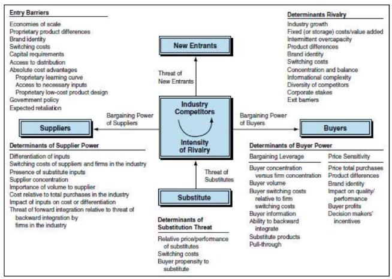
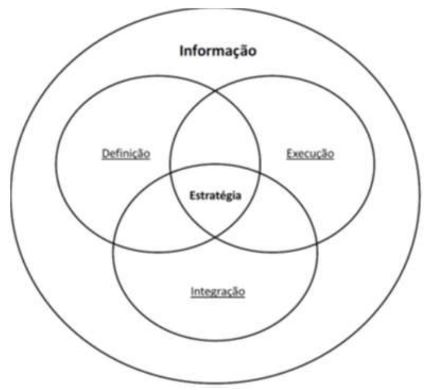
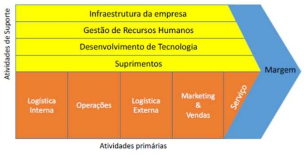

o raciocínio do ser humano tem a capacidade limitada, não adinta um programa cheio de features ou cheio de saídas se o que você precisa para solucionar um problema de decisão é algo bem limitado

-- Como gerenciar informação e conhecimento?
- Como uma organização pode crescer oferencendo a informação no tempo e no local correto?

- Por que estudar Gestão da Informação e do Conhecimento?

    - Tem muitos Investimentos em TI / Modelos de Governancia

    - Diversidade de funções nas empresas / Grid Estratégico

    - Abundância de Informação / integração entre estratégia e informação (MCGEE & PRUZAK, 1994)

    - Concorrência, globalização, recursos escassos para ser usado de forma mais eficiente (SADs ou DSSs)

    - Data Science, Big Data (SADs, ERPs, CRMs, BI), muitos dados sendo produzidos nos sistemas das empresas

    - As empresas precisão cada vez mais resolver problemas relacionados a Controle, gerenciamento de operações (SADs, ERPs, CRMs, BI)

- levantar os dados
- estruturar o problema
- criar indicadores
- acompanhar os indicadores, prever os resultados dos indicadores
- detectar qualquer tipo de anomalia ou itens que precisam de melhoria

    - A informação competitiva engloba muito mais do que a análise dos concorrentes (MCGEE & PRUZAK, 1994)

    

    - A informação é utilizada na definição de estratégias
    

    - A informação precisa estar em todos os processos da organização (todos os setores devem ter acesso a informação para conseguir aumnetar a margem de lucro e melhorando os processos)-> Business Intelligence! (informação no contexto correto, no lugar certo, na hora certa, sendo disponibilizada para quem precisa)
    

- A informação na integração de estratégias (MCGEE & PRUZAK, 1994)
    - Atuar como elemento de ligação entre a definição da estratégia e sua execução
    - Fornecer feedback para garantir que a estratégia esteja sendo executada conforme sua definição
    - Fornecer subsídios para adaptação das estratégias diante do ambiente competitivo
    - Possibilitar o aprendizado organizacional
    - Avaliar/definir estratégias de TI diante das estratégias de negócio (ou vice-versa)

_ Em síntese:
    - SIs precisão ser vistos como uma ferramenta fundamental para para obtenção de vantagem competitiva (uso da informação)
    - SIs permitem utilizar a informação como instrumento de gestão
    - SIs oferecem suporte para melhorar o relacionamento com o clientes e fornecedores.
    - SIs fornecem suporte para redução de custos, estoques, melhoram a logística (interna e externa), entre outros;
    - SIs permitem melhorar a eficiência organizacional, a produtividade, a eficiência dos processos, a satisfação…
    - Existe uma infinidade de motivos...

Desde que haja uma boa Gestão da Informação e do Conhecimento para que os SIs possam ser planejados e priorizados de forma estratégica.

