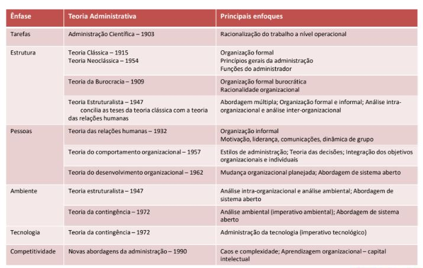
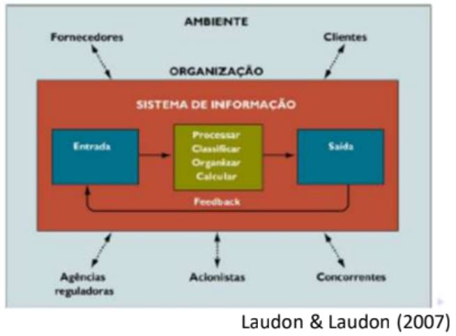
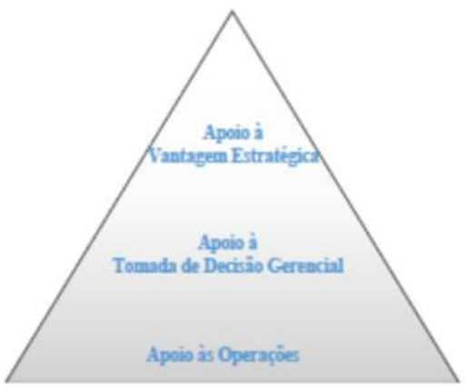
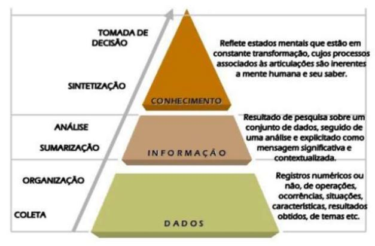
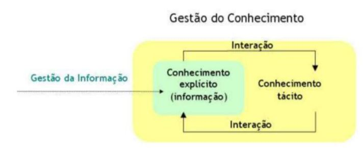
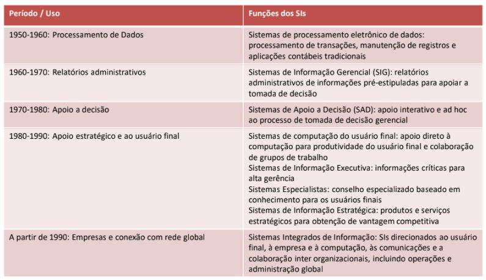

## O que é “Gestão”?

Nos manuais, é apresentada como um conjunto de técnicas, destinadas a racionalizar e otimizar o funcionamento das organizações.

- Este objetivo compreende diversos aspectos:

    - Práticas de direção das empresas: definir orientações estratégias, de otimizar as relações entre os diferentes elementos necessários para pôr em ação um sistema de ação coletiva, de definir a estrutura e a política da organização.
    - Discursos sobre os modos de organizar a produção, de conduzir os homens que a isso contribuem, de ordenar o tempo e o espaço, de pensar a empresa como uma organização racional.
    - Técnicas, processos, dispositivos que conciliam as atividades, fixam os lugares, as funções, os estatutos, definem regras de funcionamento.
    - A gestão é definitivamente um sistema de organização do poder!!!
    - Por trás de sua aparente neutralidade, é preciso compreender os funcionamentos e as características desse poder que evoluiu consideravelmente.

## Qual a função do gestor?

- O gestor, mais do que qualquer outra pessoa, interioriza fortemente a contradição entre capital/trabalho:

    - De um lado, forte identificação com os interesses da empresa um interiorização da lógica de lucro, uma adesão às normas e aos valores do sistema capitalista. (ele faz parte da mão de obra mas tem que refletir o interesse do lucro)

    - De outro, uma condição salarial submetida às imprevisibilidade da carreira, ao risco da dispensa, à pressão do trabalho e a uma competição feroz.

    (O papel do gestor é a pessoa que está fazendo essa ponte)(ele tem que tar defendendo os interecesses da empresa mas ele não é dono)(existe mecanismos de controle e acompanhamento tanto do trabalho de quem tá abaixo do gestor quanto do gestor)

	Como lidar com isso?

    - Sua função consiste em produzir um sistema que liga e combina elementos tão disparatados quanto o capital, o trabalho, as matérias-primas, a tecnologia, as regras, as normas e os procedimentos.

(Existe um ditado antigo: "O que engorda o gado é o olho do dono". Porém esse ditado é ultrapassado hoje existe gestão organizacional, nas multinacionais é impossível o dono da empresa ficar de olho em tudo)(Um bom sistema de gestão para funcionar precisa de um Sistema da Informação)
    
### O que é gerenciamento?

- O gerenciamento remonta a ideia de arranjar, instalar e providenciar

    - A providência consistem em organizar em vista de uma produção coletiva, de uma tarefa a cumprir, de uma obra a realizar

    - O arranjo ou ordenação consiste em prestar atenção ao conjunto daqueles que contribuem para essa missão, a fim de melhor mobilizá-los em vista de um fim comum, para o proveito de todos

- Hoje, em muitas empresas, o termo evoca mais a ideia de arrumação como "arranjar", "providenciar" e "arrumar"

- Porém na década de 90 advento das tecnologias Computacionais a informação e o conhecimento tornaram questão chaves para a conectividade e esse termo ganhou novo significado.

### Era da informação e do conhecimento?

- Diante das mudanças no capitalismo industrial surgiu "a era da informação e do conhecimento"

- 3 fenômenos maiores transformam o capitalismo industrial do final do século XX:

    - As lógicas de produção estão cada vez mais submetidas às pressões das lógicas financeiras. A economia financeira substituiu a economia industrial.
    
        - É a lógica financeira que faz com que a informação tenha alto valor nessa nova economia -> menos o que produzir, eu preciso conhecer para poder especular, prever, antecipar, modelar!

    - O peso dos mercados e mundialização  põem de novo em questão os modos de regulação econômica: o capital é desterritorializado (para trabalhar em um mercado regional não tem como desconsiderar o mercado mundial)

    - A fusão das telecomunicações com a informática instaura a “ditadura” do tempo real e a imediatidade das respostas às exigências dos mercados financeiros (com base nas informações você pode tormar melhores decisões aumentando sua eficiência)

## Principais teorias de Gestão

## Qual o grande desafio?

- Entendendo que a gestão não é algo neutro, mas sim um conjunto de formas de atuar no mundo que se baseiam em crenças e maneiras de pensar:

    - Como pensamos os fenômenos informação e conhecimento para a construção de modos mais interessantes e empoderados de Gestão da Informação e do Conhecimento?

    - Como entendemos onde temos de lidar nas organizações, nas relações humanas e nos processos individuais para construir essas formas de Gestão?

    - Que fenômenos exatamente lidamos em nosso dia a dia?

## Sistema de Informação

- É um conjunto de componentes inter-relacionados para coletar (ou recuperar), processar, armazenar e distribuir informações destinadas a:

    - Apoiar a tomada de decisões de uma organização

    - Coordenação de uma organização

    - Controle de uma organização

(os sistemas da informação devem apoiar todas essas etapas)

## Dados vs Informação

- A informação não se limita aos dados coletados; na verdade são dados coletados, organizados, ordenados, aos quais são atribuídos **significado e contexto para uma decisão** (MCGEE & PRUZAK, 1994)

- O conhecimento é um conjunto de informações interligadas e logicamente relacionadas, envolve a percepção do ambiente (MCGEE & PRUZAK, 1994)

    - É um nível mais elevado do que um mero conjunto de informações: **inclui reflexão, síntese, contexto**

    - Conhecimento é um entendimento (ou modelo) sobre pessoas, objetos ou eventos, derivado de informações sobre eles

(Informação - exige consenso - todo mundo que ver vai entender a mesma coisa)
(Um dos trabalhos é transformar o conhecimento tácito em explícito e disseminar esse conhecimento na organização)

Ex: 
- Dado: Valores diários de vendas

- Informação: Histórico de vendas mensal

- Conhecimento: Perfil do consumidor (ambiente, informações interligadas)(cria um modelo com a informação)

## Relação entre Gestão da Informação e do Conhecimento

A relação de gestão de informação e conhecimento é que tem um processo de interação de procurar transformar o conhecimento tácito em explícito

## Evolução dos SI com GI&C

## ESTUDO DE CASO: SISTEMA SABRE:

Sabre foi um sistema de processamento de reservas eletrônica criado pela American Airlines. Era totalmente centralizado e eletrônico, capaz de lidar com agendamentos de tripulações, rota, movimento de carga...Na época ele era o maior sistema de processamento ele usava o mesmo equipamento usado pelo pentágono para monitorar a defesa. Funcionava 24/7 não pode haver desligamento.

Sabre tem 3 componentes principais:
    - O console - operado pelo vendedor de reservas
    - Unidade central de processamento
    - A rede de comunicação

Ele foi um sistema tão importante que saiu de dentro da empresa e se tornou algo que revolucionou aviação mundial. (antigamente comprar uma passagem de avião era como comprar em uma rodoviária)

(antigamente o dono da americam airlines viajava entre os passageiros de carreira de forma anônima para entender como era a percepção dos clientes, nessas viágens ele conheceu um cara da IBM e daí tiveram a idéia de criar o sistema)

Origens do SABRE: • https://www.youtube.com/watch?v=SSGWq9VrMZ8
