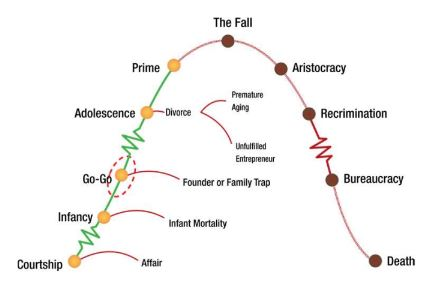
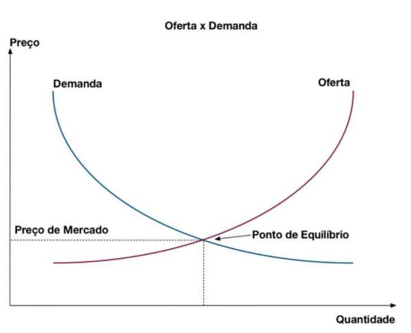
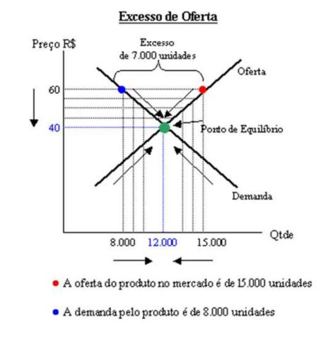
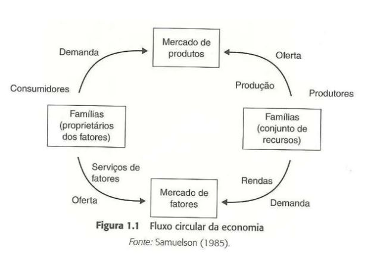

# Modelo de Estratégia de Porter

- A concorrência está no âmago do sucesso ou fracasso de uma organização

- A competição é a força motriz para adequação das atividades que podem contribuir para o seu desempenho:

    - Inovações

    - Estrutura organizacional

    - Operação: Função Produção (a forma de como a empresa agrega valor, presta ou produz algum serviço)

## Greiner: Crescimento organizacional

Existe uma relação entre a maturidade de uma empresa e o tamanho dela. 

Esses períodos de ranhuras no gráfico são processos de revolução dentro de uma empresa. Ela tem uma crise e dentro da crise ela amadurece e cresce e tem um processo de aprendisagem organisacional. Tem empresas que tem uma taxa de crescimento mais rápida e outras mais baixa.

## Adizes: Crescimento organizacional

Ele diz que as empresas tem suas crises. E se não morrer antes ela pode até chegar ao momento de Prime (melhor performace). Até chegar no pico e depois cair.

## Greiner: Características das fases de crescimento

dependendo da faze que a empresa está ela vai ter uma abordagem gerencial, de controle, de remuneração... diferente.

Fase 1: 
    
    - No início a organização é bem informal,
    
    - produz oque está em encomenda,
    
    - o estilo é empreendedor,
    
    - é monitorado apenas pelos resultados que o mercado determina,
    
    -a remuneração está associada com o sentimento de posse, de sentir dono do negócio

Fase 2: 

    - Busca maior pela eficiencia,
    
    - estilo mais gerencial (voltado ao direcionamento),
    
    - monitoramento de indicadores de custos,
    
    - motivação está associada a recompensas financeiras

Fase 3: 
    - Expanção do mercado,
    
    - questões geográficas que são incorporadas,
    
    - delegação de responsabilidade e controle através de relatórios,
    
    - Bonus, ganhos atravez da participação nos lucros.

Uma empresa jovem para concorrer com uma empresa maior ela precisa se destacar pela inovação (realidade das startup)

Depois que se tem uma estrutura muito burocrática que se torna enrigecida, as vezes é preciso voltar a buscar inovar para caminhar ao sucesso.

De uma forma de outra tudo isso está voltado a competividade e a vantagem competitiva.

## Modelo de Estratégia de Porter

12:13

- A estratégia competitiva é a busca de uma posição competitiva favorável em um segmento econômico (arena fundamental da concorrência)

	- Visa estabelecer uma posição lucrativa e sustentável contra as forças que determinam a concorrência.
	
- Dois fatores são essenciais para escolha de uma estratégia competitiva:

	- Rentabilidade do segmento econômico a longo prazo (atratividade)
	
	- Posição competitiva
		- Não importa o segmento econômico, sempre existem empresas que possuem uma rentabilidade acima da média!!!
		
- Não há regra absoluta para escolha de uma estratégia, a estratégia é dinâmica em função da rentabilidade do segmento e da posição competitiva

- O modelo de estratégia de Porter considera fatores preponderantes que explicam a relação de concorrência na dimensão atratividade para um segmento econômico.

- Portanto, a estratégia competitiva surge após a compreensão das regras da concorrência que determinam a competitividade da indústria

- A meta final da estratégia competitiva é lidar com as regras de concorrência e (em termos ideais) modificar as regras em favor da empresa.

- O modelo de Porter considera que existem 5 forças competitivas.

- O que motiva a demanda por um determinado produto ou serviço?

- O que motiva a oferta de um produto ou serviço?

- Qual o resultado da interação entre a Oferta e Demanda por um determinado produto ou serviço?

Oferta x Demanda

Oferta x Demanda: Concorrência

# Pensamento econômico

- Existem várias correntes de pensamento econômico

	- Clássica
	
	- Neoclássica
	
	- Schumpeteriana
	
	- Neoschumpeteriana

Teoria Econômica Neoclássica

- A teoria neoclássica busca provar teorias explicativas sobre o funcionamento da economia de mercado

- Assim busca explicar o funcionamento da economia através da alocação mais eficiente possível dos recursos

- Portanto em seu paradigma a economia é um universo de pequenos produtores e consumidores, livre para maximizar suas preferências em condições de certeza

- A abordagem utilizada pelos fundadores dessas correntes é que o método de análise mais adequado para os estudos econômicos deveria ser aquele desenvolvido pelas ciências exatas e da natureza (Física e Matemática)

- Assim formalizaram o "sistema de equilíbrio geral", conhecido também por "fluxo circular da economia neoclássica"

- O tipo de mercado é um complicador para as análises econômicas incluse a definição de competitividade entre as firmas

- As imperfeições do mercado levam a implicações no "pleno e ótimo uso dos recursos"

- A configuração da estrutura de mercado pode ser perfeita ou imperfeita.

- Assim, tem-se estruturas de mercado de monopólio, oligopólio e outras formas de concorrência que influenciam na formação dos preços.

Teoria Econômica neoclássica: Oferta e Demanda.

- A formação gráfica dessa teoria foi formalizada ao final do século XIX

- Conforme relações gráficas, foram formalizadas as relações

	- Função Demanda (Preço/Quantidade)

	- Função Oferta (Preço/Quantidade)

	- Equilíbrio de mercado (Oferta x Demanda)

Teoria Econômica Neoclássica: Oferta e Demanda

- Do gráfico da relação Oferta x Demanda pode-se observar que:

    - Se o preço for maior que o preço de mercado, (P1>P*), ocorre sobre de mercadorias (Q*-Qtd1)

    - Se o preço for menor que o de mercado, (P2< P*), ocorre falta de mercadoria (Qtd2 -Q*)

    - Isso que dizer que o sistema entra em equilibrio somente no ponto em que a oferta é igual à demanda (P*, Q*), ou seja, um ponto virtual de equilibrío

## Modelo de Estratégia de Porter

- De acordo com Porter, as regras de concorrência são influenciadas por 5 forças

    - Entrada de novos concorrentes

    - Ameaça de substitutos

    - Poder de negociação dos compradores

    - Rivalidade entre os concorrentes existentes

## Vantagem competitiva através de GI

- Alguns autores definem um Sistema de Informação Estratégicos (SIS) com aquele que permite suportar ou influenciar a estratégia competitiva de uma unidade de negócio

- O que caracteriza um SIS é a sua habilidade de modificar significativamente o negócio da empresa trazendo vantagem estratégica

- Um SIS não pode ser classificado por estrutura organizacional ou área funcional, qualquer SI que altere objetivos, processos, produtos ou relações da empresa com o macroambiente para trazer vantagem competitiva é um SIS

- Através da estratégia competitiva uma organização busca vantagem competitiva em seu segmento, buscando melhorias em:

    - Custo

    - Qualidade

    - Velocidade

- Portanto, um SIS ajuda a empresa a ganhar vantagem competitiva contribuindo para os objetivos estratégicos ou pela sua habilidade de aumentar significativamente a performance e produtividade.

- Na economia digital a vantagem competitiva tornou-se mais importante que antes.

- Embora a integração com plataformas digitais não tenha alterado o cerne da maior parte dos negócios, para a grande maioria, as plataformas digitais oferecem ferramentas podem alavancar competitividade:

    - Baixo custo

    - Customer Service

    - Supply Chain Management

- Dado um segmento econômico e posição, onde é possível obter vantagem competitiva?

- Como a Gestao da Informação pode melhorar o negócio?

- Contribuições da Gestão da Informação para vantagem competitiva:

    - Aplicações inovadoras
    - Armas competitivas

        - SIs podem atuar como armas competitivas para a organização ou seus concorrentes

    - Mudanças em processos

        - Estruturação de processos e rotinas que permitam integração e eficiência nos processos

    - Relacionamentos com parceiros de negócio, fornecedores e clientes

    - Redução de custos
    - Novos produtos
    - Inteligência competitiva

- A inteligência competitiva advém do processo de aquisição de informação e conhecimento para melhorar a qualidade do planejamento estratégico.

    - Serve para antecipar situações

    - Viabiliza uma estratégia de contra-ataque

    - Promove resiliência

    - Permite explorar "oportunidades de decisão"

