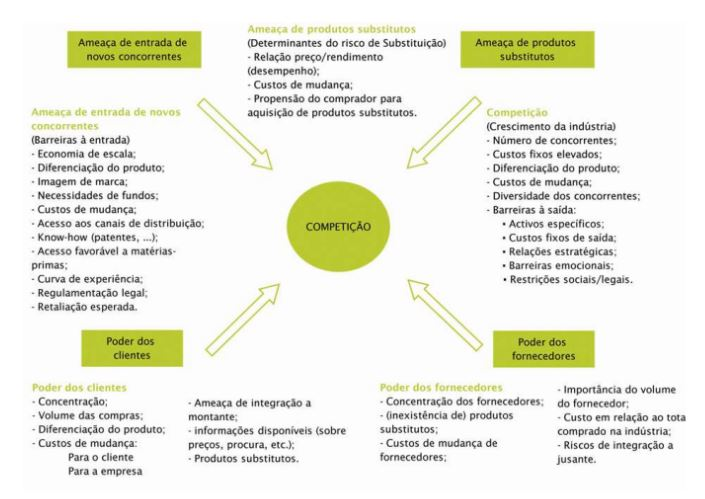

# Modelo de Estratégia de Porter

- A concorrência está no âmago do sucesso ou fracasso de uma organização

- A competição é a força motriz para adequação das atividades que podem contribuir para o seu desempenho:

    - Inovações

    - Estrutura organizacional

    - Operação: Função Produção (a forma de como a empresa agrega valor, presta ou produz algum serviço)

    - Teoricamente motiva as organizações a serem melhores

(Dependendo da concorrencia você vai ter um nível maior de dinâmica no ponto de vista competitivo).

## Greiner: Crescimento organizacional (um dos primeiros modelo de maturidade - 70's)


Existe uma relação entre a maturidade de uma empresa e o tamanho dela. 

Esses períodos de ranhuras no gráfico são processos de revolução dentro de uma empresa. Ela tem uma crise e dentro da crise ela amadurece e cresce e tem um processo de aprendisagem organisacional. Tem empresas que tem uma taxa de crescimento mais rápida e outras mais baixa.

## Adizes: Crescimento organizacional 


Ele diz que as empresas tem suas crises. E se não morrer antes ela pode até chegar ao momento de Prime (melhor performace). Até chegar no pico e depois cair. (do prime você pode cair quando fica mais confiante)

## Greiner: Características das fases de crescimento


dependendo da faze que a empresa está ela vai ter uma abordagem gerencial, de controle, de remuneração... diferente.

#### Fase 1: 
    
    - No início a organização é bem informal,
    
    - produz oque está em encomenda,
    
    - o estilo é empreendedor,
    
    - é monitorado apenas pelos resultados que o mercado determina,
    
    -a remuneração está associada com o sentimento de posse, de sentir dono do negócio

#### Fase 2: 

    - Busca maior pela eficiencia,
    
    - estilo mais gerencial (voltado ao direcionamento),
    
    - monitoramento de indicadores de custos,
    
    - motivação está associada a recompensas financeiras

#### Fase 3: 

    - Expanção do mercado
    
    - questões geográficas que são incorporadas,
    
    - delegação de responsabilidade e controle através de relatórios,
    
    - Bonus, ganhos atravez da participação nos lucros.


#### Fase 4: 

    - Consolidação da organização do ponto de vista gerencial
    
    - A empresa tem famílias de produtos
    
    - Sistema de maior controle no ponto de vista de gestão e fiscalisação
    
    - Mais burocracia
    
    - Opções de Ações, Repartição de Lucros
    

 #### Fase 5: 

    - Volta a inovar para resolver problema organizacionais
    
    - Estrutura matricial baseada nas competencias da organização
	
    - Estilo mais participativo de gestão 
    
    - Metas definidas para todos
    
    - Bonificação por áreas

Uma empresa jovem para concorrer com uma empresa maior ela precisa se destacar pela inovação (realidade das startup)

Depois que se tem uma estrutura muito burocrática que se torna enrigecida, as vezes é preciso voltar a buscar inovar para caminhar ao sucesso.

De uma forma de outra tudo isso está voltado a competividade e a vantagem competitiva.


## Modelo de Estratégia de Porter

- A estratégia competitiva é a busca de uma posição competitiva favorável em um segmento econômico (arena fundamental da concorrência)

	- Visa estabelecer uma posição lucrativa e sustentável contra as forças que determinam a concorrência.
	
- Dois fatores são essenciais para escolha de uma estratégia competitiva:

	- Rentabilidade do segmento econômico a longo prazo (atratividade)(onde existe lucro vai atrair a competidores)
	
	Posição competitiva
	
		- Não importa o segmento econômico, sempre existem empresas que possuem uma rentabilidade acima da média!!!
		
- Não há regra absoluta para escolha de uma estratégia, a estratégia é dinâmica em função da rentabilidade do segmento e da posição competitiva (tem empresas que escolhem ter uma retabilidade mais baixor para aumentar o a quantidade de clientes ou buscar menor concorrencia)


- O modelo de estratégia de Porter considera fatores preponderantes que explicam a relação de concorrência na dimensão **atratividade** para um segmento econômico.

- Portanto, a **estratégia competitiva** surge após a compreensão das regras da concorrência que determinam os pontos chaves do sucesso daquele seguimento econômico.

- A meta final da estratégia competitiva é lidar com as regras de concorrência e (em termos ideais) modificar as regras em favor da empresa.

- O modelo de Porter considera que existem **5 forças competitivas**. E tenta responder essas perguntas:

```

	- O que motiva a demanda por um determinado produto ou serviço? (procura)

	- O que motiva a oferta de um produto ou serviço? (O preço é um fator importate que definirá se haverar demanda e oferta)

	- Qual o resultado da interação entre a Oferta e Demanda por um determinado produto ou serviço?

```

### Oferta x Demanda


Para o consumidor quanto mais caro for o produto menos produto ele vai consumir

Esse esquema é usado por empresas para que não sobre mercadorias e obtenha o melhor lucro.

### Oferta x Demanda: Concorrência


Quem consegue descobrir mais rápido o valor de ponto de Equilibrio. Consegue se preparar melhor em termos organizacionais para obter um pouco mais de retabilidade e de lucro. (seja no sentido de aumentar a qualidade para converser você a pagar o preço ou seja no sentido de reduzir a qualidade no sentido de garantir o lucro)

Existe um Sistema que faz o controle: Quando o produto estava no preço X ninguém comprou, quanto o produto estava no preço Y as pessoas entram no site e fizeram a compra. (Encontrar o preço máximo que as pessoas estão dispostas a pagar)

Esse gráfico só existe porque existe concorrencia

Curiosidade: A apple usa muito o monopólio da inovação. Ela trata o produdo dela como se fosse único por causa disso ela combra um presso que ela considera como se fosse justo e quem quiser comprar compre...

(Duvida pessoal: Como fica essa relação sobre podutos infinitos (artigos digitais) e produtos que acabam copetindo contra eles mesmos. Ex: Um veículo que nunca quebra)

# Pensamento econômico

- Existem várias correntes de pensamento econômico

	- Clássica
	
	- Neoclássica
	
	- Schumpeteriana
	
	- Neoschumpeteriana

As teorias Clássicas e Neoclássica estão mais próximas do modelo Científico (usar uma forma hipotética dedutiva criar uma função matemática que represente um fenomeno, tentar explicar com um modelo analítico)

As teorias Schumpeteriana e Neoschumpeteriana, ponto de vista da inovação (diferencial, valor agregado...). Procura buscar explicar de forma "biológica" (meio darviw)(como é que uma empresa sobreviveu e outra não). Em algum momento as empresa se tornam um monopólio de inovação (apesar de está no mesmo setor cada empresa tem algo específico que vai entregar para cada cliente).


### Teoria Econômica Neoclássica

- A teoria neoclássica busca provar teorias explicativas sobre o funcionamento da economia de mercado

- Assim busca explicar o funcionamento da economia através da alocação mais eficiente possível dos recursos

- Tem uma abordagem mais matemática, mais hipotética redutiva...

- Portanto em seu paradigma a economia é um universo de pequenos produtores e consumidores, livre para maximizar suas preferências em condições de certeza

- A abordagem utilizada pelos fundadores dessas correntes é que o método de análise mais adequado para os estudos econômicos deveria ser aquele desenvolvido pelas ciências exatas e da natureza (Física e Matemática)

- Assim formalizaram o "sistema de equilíbrio geral", conhecido também por "fluxo circular da economia neoclássica"

- O tipo de mercado é um complicador para as análises econômicas incluse a definição de competitividade entre as firmas

- As imperfeições do mercado levam a implicações no "pleno e ótimo uso dos recursos"

- A configuração da estrutura de mercado pode ser perfeita ou imperfeita (alguém pode ter informações a mais, pode ter um mercado com poucos compradores e vendedores...)

- Assim, tem-se estruturas de mercado de monopólio, oligopólio e outras formas de concorrência que influenciam na formação dos preços.

#### Teoria Econômica Neoclássica: Oferta e Demanda.

- A formação gráfica dessa teoria foi formalizada ao final do século XIX

- Conforme relações gráficas, foram formalizadas as relações

	- Função Demanda (Preço/Quantidade)

	- Função Oferta (Preço/Quantidade)

	- Equilíbrio de mercado (Oferta x Demanda)


- Do gráfico da relação Oferta x Demanda pode-se observar que:

    - Se o preço for maior que o preço de mercado, (P1>P*), ocorre sobra de mercadorias (Q*-Qtd1)

    - Se o preço for menor que o de mercado, (P2< P*), ocorre falta de mercadoria (Qtd2 -Q*)

    - Isso que dizer que o sistema entra em equilibrio somente no ponto em que a oferta é igual à demanda (P*, Q*), ou seja, um ponto virtual de equilibrío 
     
(não adianta querer vender o seu produto a um preço mais caro, a medida que você aumenta o preço você tá motivando alguém vim concorrer com você) 

#### Fluxo circular da Economia


Ao mesmo tempo que os individuos compram produtos no mercado de produtos eles oferecem a sua mão de obra no mercado de produção.

Se tem falta de profissinal a mão de obra fica mais cara, se tem excesso a mão de obra fica mais barata

## Modelo de Estratégia de Porter

- De acordo com Porter, as regras de concorrência são influenciadas por **5 forças competitivas** (não são só influenciadas apenas pelo preço)
	
    - Rivalidade entre os concorrentes existentes

    - Entrada de novos concorrentes

    - Ameaça de produtos substitutos

    - Poder de negociação dos compradores

    - Poder de negociação dos fornecedores

OBS: Em alguns casos o grau de rivalidade pode está tão grande que o intuito de competir por lucro tenha se perdido e o objetivo da empresa se torne destruir a outra. Nesse caso a empresa que tiver mais recursos para sobreviver no estado negativo geralmente vai vencer.



(Para Potter a melhor coisas que você pode fazer é manter a sua margem de lucro em um patamar rasoavel mas que também não é tão alto, se você tiver uma margem de lucro muito boa você vai atrair concorrente para o seu ambiente competitivo). (Ex: Você é uma empresa que começa a cobrar muito caro pelo seu produto. Então vai aparecer outra que sabe que pode vender o mesmo produto a um preço menor).

A gente precisa de SI que fassam o acompanhamento e controle da organização, que te possibilite mensurar (antecipar) o que os concorrentes vão fazer e o que os clientes desejam e quantidade do que os clientes querem comprar para que possa preparar uma forma adequada de atender as necessidade, organizar os fatores produtivos, compra de matéria prima, contratação de funcionários, escala de funcionários... Organizar tudo na empresa para atender a demanda e ao mesmo tempo ter a capacidade analítica de fazer projeções. Isso garate você ter lucro não porque você tem uma margem de lucro excessiva (problema de entrada de novos concorrente) mas porque você se torna mais eficiente. Se sua margem de lucro é resultado da sua eficiencia seu concorrente não vai conseguir imitar sua margem de lucro e ter a mesma margem que você.

## Tipos deferentes de Estratégias

Exemplo:

Liderança em Custo - Custo mais baixo + Alvo Amplo

Enforque em Custo - Custo mais Baixo + Alvo estreito

Diferenciação - Diferenciação + Alvo amplo

Enforque em Diferenciação - Diferenciação + Alvo estreito

