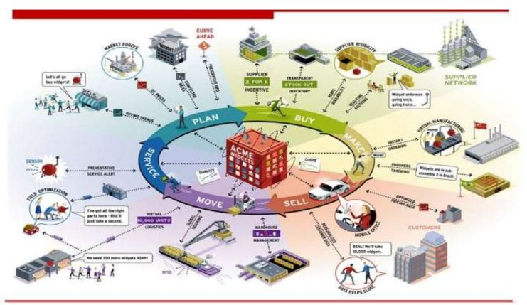

- Os fenômenos atuais que requerem decisões rápidas e um tempo de resposta cada vez menor

- Portanto, os grandes investimentos em TI realizados ao longo dos anos requerem uma gestão da informação de forma eficaz, para que problemas e oportunidades de decisão possam ser supridos
com as informações necessárias

- Sharda et al. (2014) propuseram um modelo que busca equalizar
questões estratégicas, pressões competitivas e os processos de
apoio a decisão

## Modelo Business Pressures-Responses-Support

### Modelo Business Pressures-Responses-Support

- Este modelo considera 3 componentes básicos:

    -  Pressões do ambiente competitivo

    -  Respostas, ações e contra-medidas da organização

    -  Suporte a decisões

- O **ambiente competitivo** torna-se cada vez mais complexo, no entanto esta complexidade também traz oportunidades

    - Se por um lado a globalização permite aumentar o escopo de fornecedores e a aquisição itens a um custo mais baixo, também gera fortes competidores o ambiente de concorrência

- Os fatores que promovem a competitividade (pressão) na indústria são:

    - Mercados

    - Exigências do consumidor

    - Tecnologia

    - Regulamentações da sociedade

- **Respostas, ações e contra-medidas da organização** podem ser reativas, antecipativas, adaptativas ou proativas

- Algumas empresas usam BI para melhorar a comunicação e dar suporte a gestão em seus esforços para reter os clientes e aumentar o faturamento

- O uso de BI pode dar suporte a diversas atividades gerenciais para aumentar a competitividade do negócio

#### Processos que podem ser suportados com BI:

- Planejamento estratégico
- Usar modelos de negócio inovadores
- Reestruturar os processos de negócio
- Formar de alianças
- Sistemas de gestão corporativa
- Relacionamento com parceiros
- Estimular a inovação e criatividade
- Melhorar relacionamentos com clientes
- Envolver mídias sociais e plataformas móveis
- Migrar para modelos make-to-order ou on-demand
- Etc...

### Modelo Business Pressures-Responses-Support

- **DSSs (SAD)** permitem diminuir o gap entre a performance atual de uma organização e a performance almejada

    - Alcançar Missão, Objetivos e Metas

- Mintzbert (2008) classificou a atuação dos gestores em três categorias: interpessoal, informacional e de decisão

- Para executar as atividades de gestão é necessário o suprimento eficiente de informação em tempo hábil

- Quanto maior o nível gerencial, maior o escopo das decisões e as atividades gerenciais tornam-se basicamente processos decisórios

- Decisões gerenciais representam um processo no qual os objetivos da organização são atingidos através do uso de recursos

    - Input: recursos

    - Output: alcançar as metas

    - Sucesso: output/input

- Então, GERENCIAR é TOMAR DECISÕES!

- Decidir é escolher a melhor alternativa quando se tem no mínimo 2!

- De uma forma geral os gestores tomam decisões seguindo um
processo de 4 etapas:

    - Definição / Estruturação do problema de decisão (oportunidade de decisão)

    - Construção de um modelo que descreve o problema do mundo real

    - Identificação de possíveis soluções para o problema e avaliação de soluções

    - Comparação, escolha e recomendação de uma solução potencial para o problema

- O uso desta abordagem para tomada de decisão pressupõe:

    - Número suficiente de alternativas para solução do problema

    - Capacidade de predição das consequências de escolher todos os cursos de ação considerados

    - Capacidade de racionalizar, comparar e valorar os impactos das alternativas

- Estes pressupostos são difíceis de validar totalmente (ambiente competitivo):

    - Tecnologia (SIs, Search Engines, etc) e as consequências da globalização geram cada vez possibilidades

    - Incertezas (governamental, regulatória, política, comportamento dos consumidores)

    - Necessidade de decisões rápidas versus Custos de decisões equivocadas

    - Sistemas Complexos

### 1970: Computerized Decision Support: Gorry & Scott-Morton Framework

– Nível de Estruturação (Simon, 1977)

    - Decisões são classificadas em estruturadas (programadas), semi-estruturadas e não estruturadas (não-programadas)

- Tipos de Controle (Anthony, 1965)

    - Planejamento Estratégico (longo prazo, alto nível gerencial)

    - Controle Gerencial (planejamento tático)

    - Controle Operacional

- Business Intelligence (BI) é a evolução de conceitos utilizados para DSSs (SAD) ao longo do tempo

    - Antes: Sistemas de Informação Executivo
    - Agora: Sistemas de Informação para Todos (BI)

- Sistemas de Business Intelligence possuem avanços em termos de visualização, alertas, e acompanhamento de indicadores de performance 

- O termo BI foi cunhado a partir da evolução de SIs em empresas privadas

    - BI é um termo guarda-chuva que combina arquitetura, ferramentas, base de dados, ferramentas de análise (analytics), aplicações e metodologias

    - BI é um termo de conteúdo livre pois possui diferentes significados dependendo do pessoal envolvido

Ex: Exemplo do uso de BI (Case Overbooking Frankfurt-London):

- https://www.youtube.com/watch?v=NXEL5F4_aKA

BI vs DSS(SAD)

- Similaridades e diferenças?

    - As arquiteturas são similares dado que BI teve sua origem em DSS(SAD)

    - BI implica o uso de data warehouse, enquanto DSS(SAD) pode ou não requerer

    - 