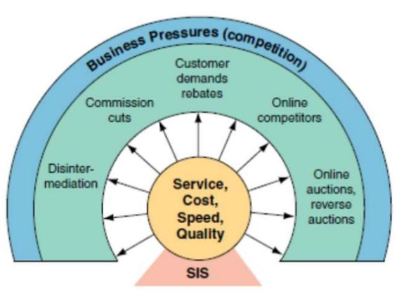

## Vantagem competitiva através de GI

- Alguns autores definem um Sistema de Informação Estratégicos (SIS) com aquele que permite suportar ou influenciar a estratégia competitiva de uma unidade de negócio

- O que caracteriza um SIS é a sua habilidade de modificar significativamente o negócio da empresa trazendo vantagem estratégica

- Um SIS não pode ser classificado por estrutura organizacional ou área funcional, qualquer SI que altere objetivos, processos, produtos ou relações da empresa com o macroambiente para trazer vantagem competitiva é um SIS

- Através da estratégia competitiva uma organização busca vantagem competitiva em seu segmento, buscando melhorias em:

    - Custo

    - Qualidade

    - Velocidade

(Ex: O uso de um CRM que melhore demais a relação da empresa com o cliente e traga vantagem a empresa em relação aos seus concorrentes)

(Ex2: (Velocidade) Um sistema da informação que melhora a logistica de uma empresa. Assim como na Amazon)

- Portanto, um SIS ajuda a empresa a ganhar vantagem competitiva contribuindo para os objetivos estratégicos ou pela sua habilidade de aumentar significativamente a performance e produtividade.

- Na economia digital a vantagem competitiva tornou-se mais importante que antes.

- Embora a integração com plataformas digitais não tenha alterado o cerne da maior parte dos negócios, para a grande maioria, as plataformas digitais oferecem ferramentas podem alavancar competitividade:

    - Baixo custo

    - Customer Service

    - Supply Chain Management

- Dado um segmento econômico e posição, onde é possível obter vantagem competitiva?

- Como a Gestao da Informação pode melhorar o negócio?

(Os SIS influenciam nos aspectos: Custos, serviços, qualidade e velocidade)

==============

- Contribuições da Gestão da Informação para vantagem competitiva:

    - Aplicações inovadoras
    
    - Armas competitivas

        - SIs podem atuar como armas competitivas para a organização ou seus concorrentes

    - Mudanças em processos

        - Estruturação de processos e rotinas que permitam integração e eficiência nos processos

    - Relacionamentos com parceiros de negócio, fornecedores e clientes

    - Redução de custos
    - Novos produtos
    - Inteligência competitiva

- A inteligência competitiva advém do processo de aquisição de informação e conhecimento para melhorar a qualidade do planejamento estratégico.

    - Serve para antecipar situações

    - Viabiliza uma estratégia de contra-ataque

    - Promove resiliência

    - Permite explorar "oportunidades de decisão"

