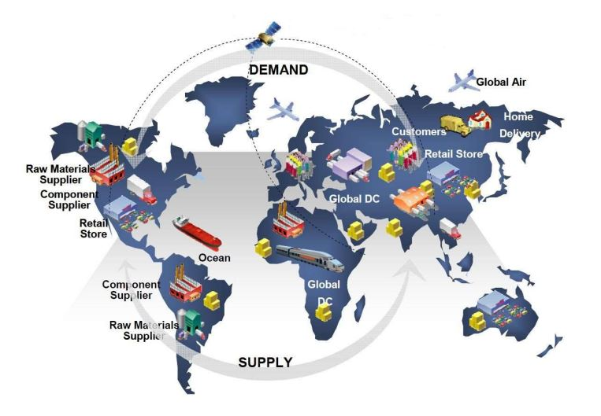
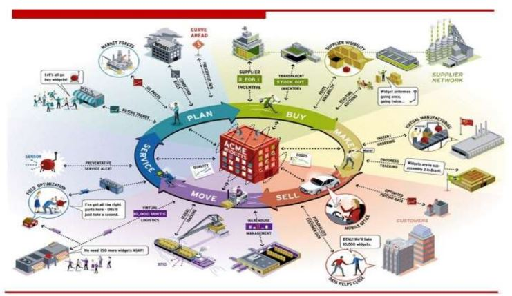
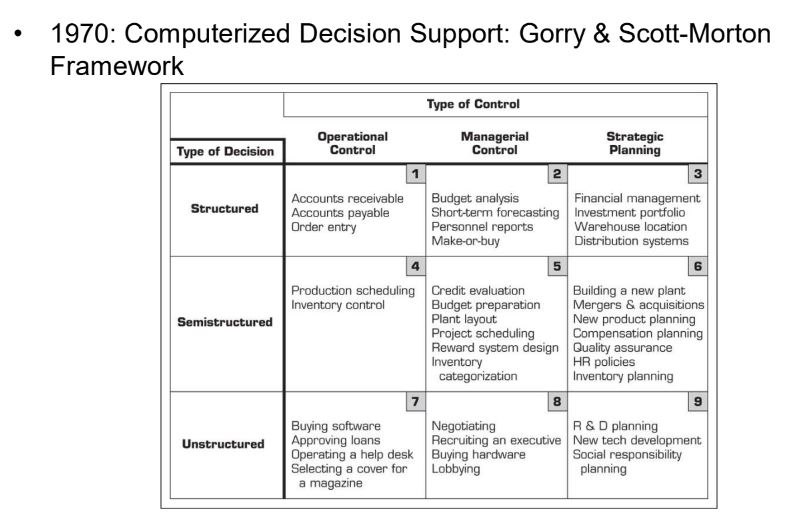
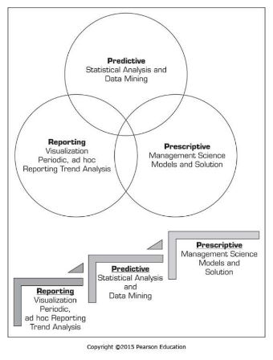
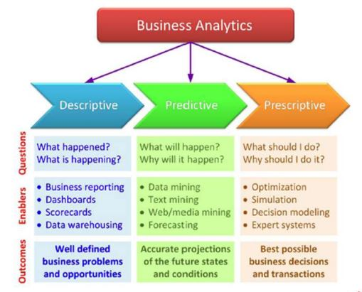

# Business Intelligence

- Os fenômenos atuais requerem decisões rápidas e um tempo de resposta cada vez menor (projetos tem data de início e data de termino, não tem tempo para ficar compilando)

- Portanto, os grandes investimentos em TI realizados ao longo dos anos requerem uma gestão da informação de forma eficaz, para que problemas e oportunidades de decisão possam ser supridos com as informações necessárias 

- Sharda et al. (2014) propuseram um modelo que busca equalizar questões estratégicas, pressões competitivas e os processos de apoio a decisão

(os investimentos em TI são difíceis de justificar, o proficional de ti deve sempre mostrar o que é relevante para tal processo)

## Modelo Business Pressures-Responses-Support (Sharda)

Tem aspectos do ambiente de negócio que tráz pressões e oportunidades para a organização e a organização deve responder essas pressões através das decisões que ela toma. Essas pressões também traz oportunidades para se destacar e desenvolver.

As Decisões vem com suporte de apoio a decisão com análises, capacidade preditiva, decisões mais acertivas obitidas através do uso da informática (uso de sistema computadorisado de apoio a decisão - geralmente associados a BI)

### Modelo Business Pressures-Responses-Support

- Este modelo considera 3 componentes básicos:

    -  Pressões do ambiente competitivo

    -  Respostas, ações e contra-medidas da organização

    -  Suporte a decisões

- O **ambiente competitivo** torna-se cada vez mais complexo, no entanto esta complexidade também traz oportunidades

    - Se por um lado a globalização permite aumentar o escopo de fornecedores e a aquisição itens a um custo mais baixo, também gera fortes competidores o ambiente de concorrência

- Os fatores que promovem a competitividade (pressão) na indústria são:

    - Mercados

    - Exigências do consumidor

    - Tecnologia

    - Regulamentações da sociedade

Alguns exemplos: 

(Cada vez mais os clientes se tornam mais exigentes e menos leais)

- **Respostas, ações e contra-medidas da organização** podem ser reativas, antecipativas, adaptativas ou proativas

- Algumas empresas usam BI para melhorar a comunicação e dar suporte a gestão em seus esforços para reter os clientes e aumentar o faturamento

- O uso de BI pode dar suporte a diversas atividades gerenciais para aumentar a competitividade do negócio

#### Processos que podem ser suportados com BI:

- Planejamento estratégico
- Usar modelos de negócio inovadores
- Reestruturar os processos de negócio
- Formar de alianças
- Sistemas de gestão corporativa
- Relacionamento com parceiros
- Estimular a inovação e criatividade
- Melhorar relacionamentos com clientes
- Envolver mídias sociais e plataformas móveis
- Migrar para modelos make-to-order ou on-demand
- Etc...

### Modelo Business Pressures-Responses-Support

- **DSSs (SAD)** permitem diminuir o gap entre a performance atual de uma organização e a performance almejada

    - Alcançar Missão, Objetivos e Metas

A forma de organizar informações para decisões tá associada a forma dos gestores:

- Mintzbert (2008) classificou a atuação dos gestores em três categorias: **interpessoal**, **informacional** e de **decisão**

- Para executar as atividades de gestão é necessário o suprimento eficiente de informação em tempo hábil

- Quanto maior o nível gerencial, maior o escopo das decisões e as atividades gerenciais tornam-se basicamente processos decisórios

(O modelo de Sharda mostra como Decisões e o Suporte a decisão tem destaque)

- Decisões gerenciais representam um processo no qual os objetivos da organização são atingidos através do uso de recursos 

    - Input: recursos

    - Output: alcançar as metas

    - Sucesso: output/input

(A organização está sempre buscando eficiencia, o que se quer é aumentar a eficiencia através da minimisação de recursos para alcançar algum tipo de output ou meta)(quanto mais output gera com menos input mais efeciente a gente se torna)(relação: Benefício/Custo -> retabilidade)

- Então, GERENCIAR é TOMAR DECISÕES!

- Decidir é escolher a melhor alternativa quando se tem no mínimo 2!

- De uma forma geral os gestores tomam decisões seguindo um processo de 4 etapas:

    - Definição / Estruturação do problema de decisão (oportunidade de decisão)

    - Construção de um modelo que descreve o problema do mundo real

    - Identificação de possíveis soluções para o problema e avaliação de soluções

    - Comparação, escolha e recomendação de uma solução potencial para o problema

- O uso desta abordagem para tomada de decisão pressupõe:

    - Número suficiente de alternativas para solução do problema

    - Capacidade de predição das consequências de escolher todos os cursos de ação considerados

    - Capacidade de racionalizar, comparar e valorar os impactos das alternativas

- Estes pressupostos são difíceis de validar totalmente (ambiente competitivo):

    - Tecnologia (SIs, Search Engines, etc) e as consequências da globalização geram cada vez possibilidades (nem sempre se tem tecnologia para isso)

    - Incertezas (governamental, regulatória, política, comportamento dos consumidores)

    - Necessidade de decisões rápidas versus Custos de decisões equivocadas

    - Sistemas Complexos

(22:03)

### 1970: Computerized Decision Support: Gorry & Scott-Morton Framework

– Nível de Estruturação (Simon, 1977)

    - Decisões são classificadas em estruturadas (programadas), semi-estruturadas e não estruturadas (não-programadas)

- Tipos de Controle (Anthony, 1965)

    - Planejamento Estratégico (longo prazo, alto nível gerencial)

    - Controle Gerencial (planejamento tático)

    - Controle Operacional

- Business Intelligence (BI) é a evolução de conceitos utilizados para DSSs (SAD) ao longo do tempo

    - Antes: Sistemas de Informação Executivo
    - Agora: Sistemas de Informação para Todos (BI)

- Sistemas de Business Intelligence possuem avanços em termos de visualização, alertas, e acompanhamento de indicadores de performance 

- O termo BI foi cunhado a partir da evolução de SIs em empresas privadas

    - BI é um termo guarda-chuva que combina arquitetura, ferramentas, base de dados, ferramentas de análise (analytics), aplicações e metodologias

    - BI é um termo de conteúdo livre pois possui diferentes significados dependendo do pessoal envolvido

Ex: Exemplo do uso de BI (Case Overbooking Frankfurt-London):

- https://www.youtube.com/watch?v=NXEL5F4_aKA

BI vs DSS(SAD)

- Similaridades e diferenças?

    - As arquiteturas são similares dado que BI teve sua origem em DSS(SAD)

    - BI implica o uso de data warehouse, enquanto DSS(SAD) pode ou não requerer

    - Tendo em vista o custo associado ao desenvolvimento e manutenção de data warehouse. BI é mais apropriado para organizações maiores, enquanto DSS (SAD)pode ser apropriado para qualquer tipo de organização

    - Enquanto um DSS (SAD) é construído para suportar diretamente uma decisão específica, sistemas de BI são voltados para fornecer informação assertiva em tempo real, muitas vezes suportando decisões indiretamente.

    - A maior parte dos sistemas de BI são construídos com ferramentas comerciais disponíveis, ajustadas para as necessidades da organização.

    - No desenvolvimento de DSSs (SAD) o interesse está voltado para a construção de soluções para problemas não estruturados, portanto é requerido um uso maior de programação para customizar a solução.

    - Devido ao nível de especialização, as metodologias e algumas ferramentas DSS são desenvolvidas no âmbito acadêmico, enquanto que no contexto de BI em sua grande maioria por empresas de software.

    - Embora algumas pessoas pensam que DSS (SAD) e sistemas BI são equivalentes, estes sistemas não são
        
        - Algumas pessoas acreditam que DSS (SAD) está contido em BI como uma de suas ferramentas de analytics.

        - Outras pessoas pensam que sistemas BI são um caso especial de DSS que focam em geração de relatórios, comunicação, colaboração, etc.

        - Outra visão (Watson 2005) é que BI representa um fruto de uma revolução contínua e que DSS (SAD) é um dos elementos originais de BI
    
    - A convenção adotada neste curso é a visão de BI separada de DSS(SAD), embora sejam consideradas as conexões entre BI-DSS.

    ## Analytics

    - Seria algo novo o apenas um novo nome para...
        
        - A palavra Analytics substituiu a terminologia usada previamente para componentes de tecnologias de apoio a decisão que tiveram vários rótulos ao longo do tempo

        - Em algumas situações, é comum inclusive o uso da palavra Analytics no lugar de BI

    - Embora autores e consultores tenham definido com pequenas diferenças o termo Analytics, pode-se definir como:

        **- O processo de desenvolver decisões focadas em ações ou recomendações para ações baseadas em insights provenientes de dados históricos**

    - O INFORMS foi responável pela maior iniciativa de organizar e promover Analytics

    - De acordo com o INFORMS:

    **"Analytics representa a combinação de tecnologias computacionais, técnicas de gestão (Management Science) e estatística para resolver problemas reais"**

    - Obviamente outras organizações propuseram sua própria interpretação, por exemplo, o SAS propôs 8 níveis de Analytics:

        - Relatórios padronizados
        - Relatórios ad hoc
        - OLAP
        - Alertas
        - Análise Estatística
        - Forecasting
        - Predictive Modeling
        - Otimização

    - Premissa das ferramentas de Analytics:

    **"Quando uma organização possui uma boa perspectiva do que está acontecendo e daquilo que pode acontecer, a organização pode empregar outras técnicas que permitem as melhores decisões tendo em vista as circunstâncias"**

    - A idéia de observar todos os dados para entender o que está acontecendo, o que pode acontecer e fazer o melhor foi encapsulada em 3 níveis de Analytics pelo INFORMS:

        - Descriptive Analytics

        - Predictive Analytics

        - Prescriptive Analytics

### Descriptive Analytics

- Relatórios de (Descriptive) Analytics se referem ao conhecimento daquilo que está acontecendo na organização e entendimento de algumas tendências

- Envolve a consolidação de fontes de dados e disponibilidade de todos os dados relevantes de modo a parmitir a geração de relatórios e análises

- O desenvolvimento dessa estrutura de dados parte do data warehouse

- Um ponto essencial aqui são as tecnologias de visualização de dados 
    **- Quem tiver maior interesse, tentar cursar disciplina de Prof.Nivan Ferreira!!!"** (2022)

### Predictive Analytics

- (Predictive) Analytics Preditiva tem o objetivo de determinar aquilo que pode acontecer no futuro

- São análises baseadas em técnicas estatísticas assim como técnicas mais modernas que poderiam ser classificadas genericamente como data mining

- O objetivo destas técnicas é ser capaz de antecipar:

    - Se um cliente deseja migrar para um concorrente (Chum)

    - Aquilo que o cliente deseja comprar e quanto  

    - Que oferta um cliente pode aceitar

    - Risco de inadimplência

- Existem diversas técnicas para estas aplicações, incluindo vários tipos de algoritmos de classificação/segmentação/clusterização, tais como arvores de decisão, redes neurais.

### Prescriptive Analytics

- (Prescriptive) Analyticsc Prescritiva é a terceira categoria de analytics que considera aquilo que está acontecendo e o que foi previsto para tomar decisões (prescrever) que levem à melhor performance possível.

- Este conjunto de ferramentas evoluiu sob o termo guarda-chuva de "Pesquisa Operacional" e "Management Science"

- Busca a otimização da performance do sistema

- O objetivo é a uma recomendação (decisão) para uma ação específica
    - Em alguns casos é denominada de Analytics para Decisão ou Analytics Normativa

Analytics

- https://www.informs.org/Impact/O.R.-Analytics-Success-Stories/

- How analytics enhance the guest experience at Walt Disney World
    - https://www.informs.org/Impact/O.R.-Analytics-Success-Stories/Industry-
Profiles/Disney

- Simplifying Vehicle Choice: Ford’s Fleet Purchase Planner
    - https://www.youtube.com/watch?v=HErOv30WLqQ

Overcoming the Challenges of Aircraft Engine Maintenance and Repair (American Airlines) 
- https://www.informs.org/Impact/O.R.-Analytics-Success-Stories/Overcoming-the-Challenges-of-Aircraft-Engine-Maintenance-and-Repair 
– https://www.youtube.com/watch?v=_Gq4lga5ER4

Edelman Award

- A competição Franz Edelman iniciou em 1972

- Busca premiar iniciativas de Analytics (PO) na iniciativa privada, ONGs e departamentos de Estado
    - Organizações com ou sem fins lucrativos!

- O premio é concedido para trabalhos implementados, não por um paper ou por uma apresentação de trabalho!

- A empresa que usou o trabalho vencedor recebe um prêmio de citação e os autores do trabalho um prêmio em dinheiro

- Os trabalhos finalistas são publicados na Interfaces / Journal of Applied Analytics

Os projetos finalistas desta competição já alcançaram retorno financeiro de mais de 250 bilhões de dólares! 
– https://www.informs.org/Resource-Center/Video-Library/Edelman-Competition-Videos

• INFORMS O.R. and Analytics Impact (5:26) 
– https://www.youtube.com/watch?v=lq0B6wnAbk0

• INFORMS 2017 Edelman Gala Video (5:26) 
– https://www.youtube.com/watch?v=uApYRpZL_FY

- 2018 Edelman Finalist Turner Broadcasting (37:29) 
– https://www.youtube.com/watch?v=KJ5aK4-pRWo

• Turner has designed and implemented innovative and integrated forecasting and optimization models that power audience targeting solutions disrupting decades-old paradigms and business processes in the media industry, and producing significant sales and advertisement efficiencies for Turner and its clients. Turner is on track to sell 50 percent of its inventory through audience targeting by 2020, representing billions in ad revenue.

• 2018 Edelman Finalist Intel 

– https://www.youtube.com/watch?v=gdIESpRi00k

• Analytics Makes Inventory Planning A Lights-Out Activity at Intel Corporation Intel, which employs more than 100,000 people in over 70 countries around the world and has an annual revenue of $60 billion, implemented a fully automated Multi-Echelon Inventory Optimization (MEIO) based inventory target-setting system managing $1 billion daily in finished goods inventory representing over $40B a year in sales. Algorithm-derived inventory targets at Intel are accepted by planners +99.5 percent of the time and have simultaneously driven higher customer service and lower inventory levels resulting in over $1.3B in gross profit since 2014.
In addition, customers are delighted: since MEIO was implemented at all of Intel’s vendor managed inventory hubs in 2012, customer satisfaction has never been higher and Intel has landed in the top-10 of Gartner’s Supply Chain Top-25 every year. Faculty in the department of Business Analytics and Statistics at the University of Tennessee, Knoxville and the supply chain software company Logility also contributed to this project.

2018 Edelman Finalist Europcar 

– https://www.youtube.com/watch?v=3ikQmmyNSQg

• Europcar Integrates Forecast, Simulation and Optimization Techniques in a Capacity and Revenue
Management System Europcar, the leading European car rental company, partnered with ACT Operations
Research to create Opticar, a complex decision support system. Opticar features forecasts, discrete event
simulations and optimization techniques providing an integrated approach to revenue and capacity
management. Opticar anticipates future demand for Europcar’s vehicles fleet, up to six months in advance,
improving capacity management. In addition, Opticar enables Europcar to optimize its approach to revenue
management and rental pricing, taking into account competitors information, the currently available fleet and
expected demand for vehicles. Opticar provides a shared mathematical approach used as a starting point for all
daily operations to nine Europcar’s corporate countries.

• 2018 Edelman Finalist Pediatric Heart Network 
– https://www.youtube.com/watch?v=8U_T_m8rStg

• Collaborative Systems Analytics: Establishing Effective Clinical Practice Guidelines for Advancing Congenital
Cardiac Care The Pediatric Heart Network enlisted researchers with the Georgia Institute of Technology to
create clinical practice guidelines (CPG) for pre-, intra-, and post-surgical care of patients with congenital heart
defects (CHDs), the most common birth defect, impacting nearly 1 million children and 1.4 million adults in the
U.S. Substantial variances in surgical practices to treat patients with CHDs among different healthcare centers
were reflected in inconsistent surgical outcomes, some of which resulted in negative consequences for patients.
By studying the nine leading U.S. pediatric centers, the researchers identified seven significant factors for
influencing surgical outcome, and implemented a CPG that enables patients to be removed from breathing
apparatuses earlier, lowered the rate of reintubation, and decreased the time patients need to remain in the
intensive care unit. These guidelines also realized a cost savings of 27 percent, which translates to $13,500 per
patient.

2018 Edelman Winner Federal Communications Comission

– https://www.youtube.com/watch?v=cSG5D7BOzWQ

• 2018 Edelman Winner: Unlocking the Beachfront: Using
Operations Research to Repurpose Wireless Spectrum. The
Federal Communications Commission (FCC) recently
completed the world’s first two-sided spectrum auction,
reclaiming spectrum from TV broadcasters to meet exploding
demand for wireless services. Operations research tools–
including optimization, simulation, and SAT-solvers – were
essential to both the design and implementation of the auction.
The auction was one of the most successful in the FCC’s
history, repurposing 84 MHz of spectrum and generating revenue of nearly $20 billion, including more than $10 billion in new capital for the broadcast TV industry and over $7 billion to
pay down the U.S. deficit.

