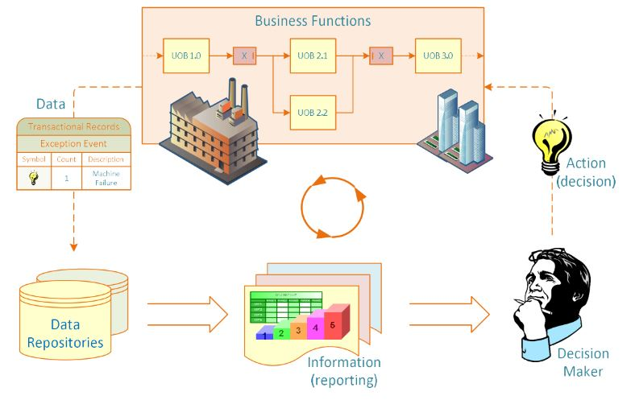

### Objetivos de Aprendizado

• Definir relatórios de negócios e entender sua evolução histórica

• Reconhecer a necessidade e o poder dos relatórios de negócios

• Compreender a importância da visualização de dados/informações

• Aprender diferentes tipos de técnicas de visualização

• Apreciar o valor que a análise visual agrega ao BI/BA

• Conhecer os recursos e as limitações dos dashboards

• Compreender a natureza do business performance management (BPM)

• Aprender a metodologia BPM de circuito fechado

• Descrever os elementos básicos dos balanced scorecards

==================

# Definições e Conceitos

• Relatório = Informação -> Decisão

• Relatório? 

  – Qualquer artefato de comunicação preparado para transmitir informações específicas
  
• Um relatório pode cumprir muitas funções:

– Garantir o funcionamento departamental adequado 

– Fornecer informações 

– Fornecer os resultados de uma análise 

– Persuadir os outros a agirem

– Criar uma memória organizacional

## O que é um relatório empresarial?

• Um documento escrito que contém informações sobre assuntos empresariais. 

• **Objetivo:** melhorar as decisões gerenciais

• **Fonte:** dados de dentro e de fora da organização (através do uso de ETL) 

• **Formato:** texto + tabelas + gráficos

• **Distribuição:** impressa, e-mail, portal/intranet 

• Aquisição de dados -> geração de informações -> Tomada de decisão -> Gerenciamento de processos

## Business Reporting

## Chave para qualquer relatório bem sucessivo

- Clareza...

- Brevidade...

- Completude...

- Correção...

• Tipos de relatório (em termos de conteúdo e formato)

  - Informal - uma única carta ou memorando

  - Formal - 10 a 100 páginas; capa + resumo + texto

  - Relatório breve - periódico, informativo, investigativo

## Tipos de Business Reporting

• Relatórios de gerenciamento de métricas 

  – Ajuda a gerenciar o desempenho dos negócios por meio de métricas (SLAs para externos; KPIs para internos)

  – Pode ser usado como parte do Six Sigma e/ou TQM
  
• Dashboards 

  – Apresentação gráfica de vários indicadores de desempenho em uma única página usando mostradores/medidores
  
• Balanced Scorecard 

  – Incluem indicadores financeiros, de clientes, de processos empresariais, e de aprendizado & crescimento
  
## Componentes de Business Reporting Systems

• Características comuns 
  – OLTP (processamento de transações online) 
    • ERP, POS, SCM, RFID, Sensores, Web,...
    
• Fornecimento de dados (volume, variedade, velocidade, ...) 

• ETL

• Armazenamento de dados

• Lógica de negócios

• Meio de publicação

• Garantia

## Visualização de Dados e Informação

“The use of visual representations to explore, make sense of, and communicate data.”

• Visualização de dados vs. Visualização de informações

• Informação = agregação, resumo e contextualização de dados

• Relacionado a gráficos de informação, visualização científica e gráficos estatísticos

• Muitas vezes inclui tabelas, gráficos, ilustrações,...

## Uma Breve História da Visualização de Dados

• A visualização de dados pode remontar ao século II dC

• A maioria dos desenvolvimentos ocorreu nos últimos dois séculos e meio

• Até recentemente, não era reconhecido como uma disciplina

• As formas visuais mais populares de hoje remontam a alguns séculos

## O primeiro gráfico de pizza criado por Williaw Playfair em 1801

William Playfair é amplamente creditado como o inventor do gráfico moderno, tendo criado os primeiros gráficos de linha e de pizza

**Dizimação do exército de Napoleão durante a campanha russa de 1812**

Imdiscutivelmente o gráfico multidimensional mais popular

• 1900s - 
  – atitude mais formal em relação à visualização 
  – concentre-se em cores, escalas de valor e rotulagem
  – Publicação do livro Semiologie Graphique
  
• Década de 2000
  - Surgimento da Internet como meio de visualização da informação, elevando a alfabetização visual
  - Incorpora interação, animação, renderização de gráficos 3D, mundos virtuais, feed de dados em tempo real
   
• 2010 e além -?

## Diferentes Tipos de Tabelas e Gráficos

• Qual usar? Quando e onde?

- Gráfico e Diagramas Básicos
  - Gráfico de linha
  - Gráfico de barras
  - Gráfico de pizza
  - Gráfico de Dispersão
  - Gráfico de bolhas
  
- Gráficos e Diagramas Especializados
  - Histograma
  - Gráfico de Gantt
  - Gráfico PERT
  - Mapa geográfico
  - Bullet Graph
  - Mapa de Calor / Mapa de Árvore
  - Tabela de destaque
  

Ex: Um mapa da riqueza e saúde das nações

## O surgimento da visualização de dados e da análise visual

- Quadrante Mágico para Business Intelligence e Plataformas de Análise (Fonte:Gartner.com)

  - Muitas empresas de visualização de dados estão no 4 quadrante
  
  - Há um movimento em direção à visualização 
  

  
- Surgimento de novas empresas  
  - Tableau, Spotfire, QlikView,...
  
• Maior foco pelos grandes jogadores 
  – MicroStrategy melhorou o Visual Insight 
  – SAP lançou o Visual Intelligence 
  – SAS lançou o Visual Analytics 
  – A Microsoft reforçou o PowerPivot com o Power View
  – A IBM lançou o Cognos Insight
  - Oracle adquiriu o Endeca
  
## Visual Anaytics

• Um termo recentemente cunhado 
  – Visualização de informações + análise preditiva
  
• Visualização de informação 
  – Descritivo, voltado para trás 
  – "O que aconteceu" "o que está acontecendo"
  
• Análise preditiva 
  – Preditivo, focado no futuro 
  – "O que vai acontecer" "por que isso vai acontecer"
  
• Há uma forte mudança em direção à análise visual

## Visual Anaytics do SAS institute

• SAS Visual Analytics Architecture – Big data + In memory + Massively parallel processing + ..

• Em teradatauniversitynetwork.com, você pode aprender mais sobre o SAS VA, experimentar a
ferramenta

## Painéis (Dashboards) de Desempenho

• Os painéis de desempenho são comumente usados em grupos de software BPM e plataformas de BI 

• Os painéis fornecem exibições visuais de informações importantes que são consolidadas e organizadas em uma única tela, para que as informações possam ser digeridas de uma só vez e facilmente perfuradas e exploradas

• Design do Painel
  – O desafio fundamental do design do painel é exibir todas as informações necessárias em uma única tela, de
forma clara e sem distrações, de uma maneira que possa ser assimilada rapidamente

• Três camadas de informação
  - Monitoramento
  - Análise
  - Gestão

• O que procurar em um painel 

– Uso de componentes visuais para destacar dados e exceções que requerem ação 
– Que seja transparente para o usuário, o que significa que ele requer treinamento mínimo e é extremamente fácil de usar 
– Que combine dados de uma variedade de sistemas em uma visão única, resumida e unificada dos negócios
- Que habilite drill down ou drill through para fontes ou relatórios de dados subjacentes
- Que apresente uma visão dinâmica e do mundo real com dados oportunos
- Que exija pouca codificação para implementar/implantar/manter

## Melhores práticas em Design de Painéis

• Utilizar Benchmark KPIs com padrões do setor 
• Agrupar métricas com metadados contextuais
• Validar o design com um especialista em usabilidade
• Priorizar e classificar alertas e exceções
• Enriquecer o painel com comentários de usuários comerciais
• Apresentar informações em três níveis diferentes
• Escolher as construções visuais certas
• Fornecer análises guiadas

## Business Performance Management (BPM)

• O Business Performance Management (BPM) é...

– Um sistema em tempo real que alerta os gerentes sobre oportunidades em potencial, problemas e ameaças iminentes e os capacita a reagir por meio de modelos e colaboração. 

• Também chamado de Corporate Performance Management (CPM da Gartner Group), Enterprise Performance Management (EPM da Oracle), Strategic Enterprise Management (SEM da SAP)

• BPM refere-se aos processos, metodologias, métricas e tecnologias de negócios usados pelas empresas para medir, monitorar e gerenciar o desempenho dos negócios. 

• O BPM abrange três componentes principais 

– Um conjunto de processos integrados (e de circuito fechado) de gerenciamento e análise, suportados pela tecnologia...
– Ferramentas para as empresas definirem objetivos estratégicos e depois medirem/gerenciarem o desempenho em relação a eles 
– Métodos e ferramentas para monitorar os principais indicadores de desempenho (KPIs), vinculados à estratégia organizacional

## Um processo de circuito fechado para otimizar o desempenho dos negócios

- Etapas do processo
  - Definir Estratégia
  - Planejar
  - Monitorar/analisar
  - Atuar/ajustar

- Cada um com suas próprias etapas do processo

## Estratégia: Para onde queremos ir?

**Planejamento estratégico**

• Tarefas comuns para o processo de planejamento estratégico:
1. Realizar uma análise da situação atual
2. Determinar o horizonte de planejamento
3. Realizar uma verificação do ambiente
4. Identificar fatores críticos de sucesso
5. Concluir uma análise de lacunas
6. Criar uma visão estratégica
7. Desenvolver uma estratégia de negócios
8. Identificar objetivos e metas estratégicas

## Planejar: Como chegaremos até lá?

**Planejamento operacional**

• Plano operacional: plano que traduz os objetivos e metas estratégicas de uma organização em um conjunto de táticas e iniciativas bem definidas, requisitos de recursos e resultados esperados para algum período futuro (geralmente um ano). 

• O planejamento operacional pode ser 
  – Centrado na tática (focado operacionalmente) 
  – Plano centrado no orçamento (focado financeiramente)
  
## Monitorar/analisar: como estamos indo?

**Uma estrutura abrangente para monitorar o desempenho deve abordar duas questões principais:**

- O que monitorar?
  - Fatores críticos de sucesso
  - Objetivos e metas estratégicas

- Como monitorar?

## Agir e ajustar: O que precisamos fazer de maneira diferente?

• O sucesso (ou mera sobrevivência) depende de novos projetos: criação de novos produtos, entrada em novos mercados, aquisição de novos clientes (ou negócios) ou racionalização de alguns processos. 

• Muitos novos projetos e empreendimentos fracassam! 

• Qual é a chance de falhar? 
  – 60% dos filmes de Hollywood falham
  – 70% dos grandes projetos de TI falham,...

## Medição de Desempenho

**Sistema de medição de desempenho**

• Um sistema que auxilia os gerentes a rastrear as implementações da estratégia de negócios, comparando os resultados reais com as metas e objetivos estratégicos 

– Compreende métodos comparativos sistemáticos que indicam progresso (ou falta dele) em relação às metas

## KPIs e métricas operacionais

**Key Performance Indicator (KPI)** 
• Um KPI representa um objetivo estratégico e métricas que medem o desempenho em relação a uma meta

• Diferenciando recursos de KPIs:
  - Estratégia
  - Metas
  - Ranges
  - Codificações
  - Prazos
  - Benchmarks

**Key Performance Indicator (KPI)** 

• **KPIs de resultado** vs. **KPIs de direcionamento**

• Áreas operacionais cobertas por KPIs de direcionamento 
  – Desempenho do cliente 
  – Desempenho do serviço 
  – Operações de vendas 
  – Plano/previsão de vendas

## Sistemas de Medição de Desempenho

• Balanced Scorecard (BSC) 

• Uma metodologia de medição e gerenciamento de desempenho que ajuda a traduzir os objetivos e metas financeiros, de clientes, de processos internos e de aprendizado e crescimento de uma organização em um conjunto de iniciativas acionáveis

• “The Balanced Scorecard: Measures that drive performance“ (HBR, 1992)

## Balanced Scorecard

## Six Sigma como um sistema de medição de desempenho

**Six Sigma**

• Uma metodologia de gerenciamento de desempenho que visa reduzir o número de defeitos em um processo de negócios para o mais próximo possível de zero defeitos por milhão de oportunidades (DPMO)

• O modelo de desempenho DMAIC 

– Um modelo de melhoria de negócios em circuito fechado que abrange as etapas de **definição, medição, análise, melhoria (improving) e controle** de um processo

• Lean Six Sigma

– Fabricação enxuta / produção enxuta
- Produção enxuta versus seis sigma?

## Comparação entre Balanced Scorecard e Six Sigma

