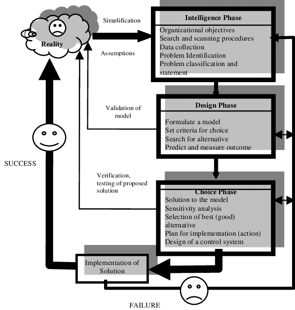

Fases do processo de decisão

-- Humanos conscientemente ou subconscientemente seguem um processo de decisão sistemática (Simon, 1977)

- Inteligência: percepção do indivíduo e a capacidade de análise.

- Design: 

- Escolha

- Implementação

- Monitoramento (alguns dizem que faz parte da faze de inteligência)

