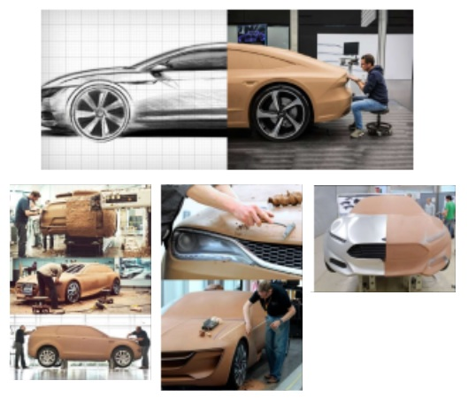
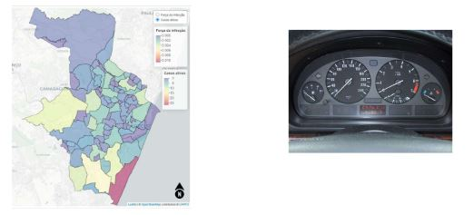
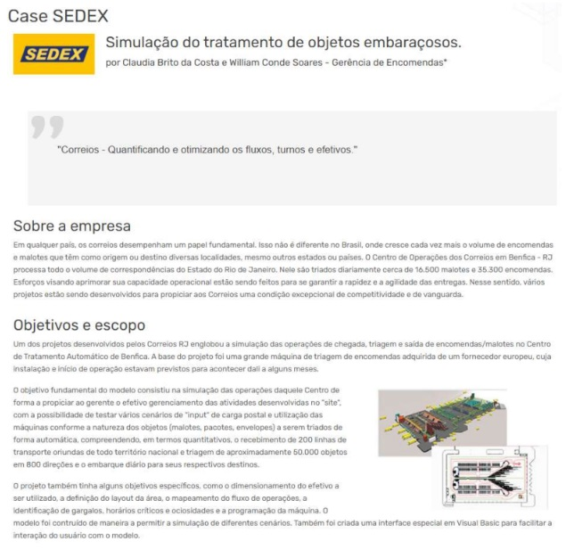
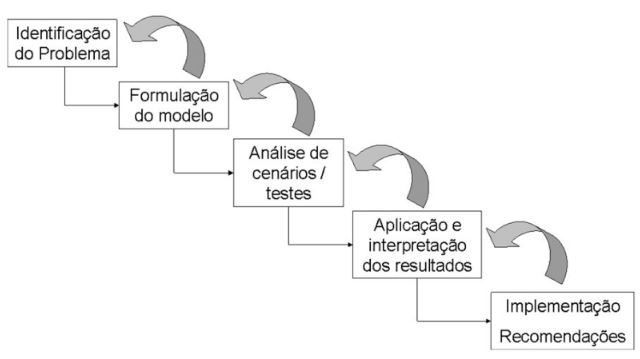
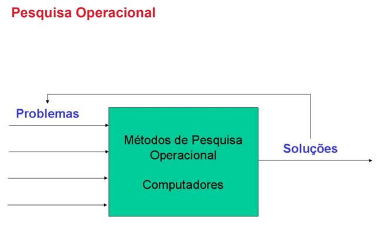
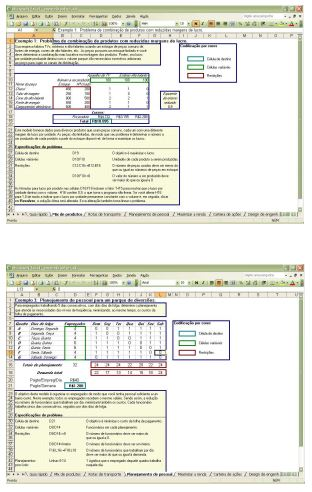
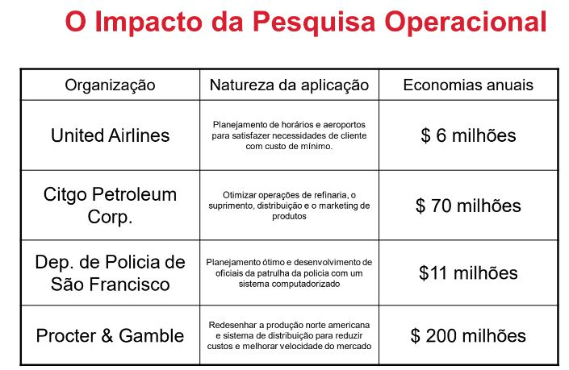
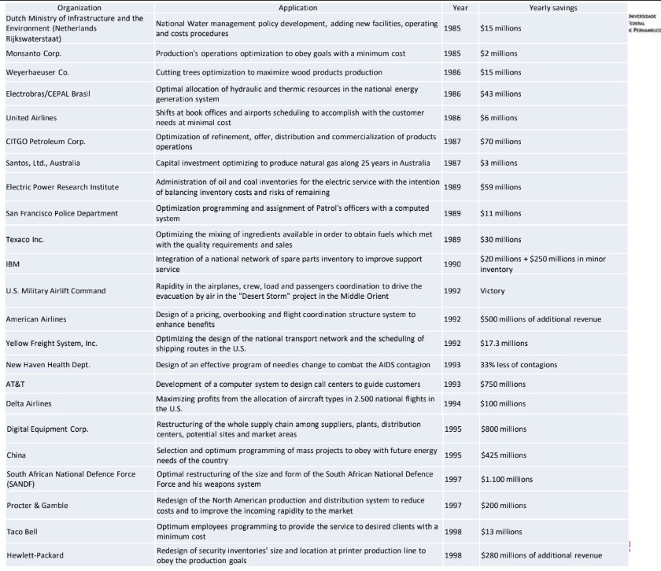

# Métodos e Modelos

Um modelo é uma simplificação da realidade...

- Modelos físicos - protótipos de carros, maquetes (hj c/ visualizaçao 3d?)




- modelo analogo (modelo semelhante)



- modelo matemático (por uma comparação) (representação matemática de problemas)

  - Case Votorantim: https://www.youtube.com/watch?v=N_iegjhtDGU
  
  - Case SEDEX: https://www.youtube.com/watch?v=rw5lVM0aG54
  


- Qual o limite da simplificação de um modelo?

- Qual o limite da distância para realidade?


- Hipóteses

- Trade-off entre distância da realidade e custos da modelagem

- Trade-off entre quais erros serão cometidos!!!

(quanto mais próximo da rapresentação mais caro é o modelo)

```
“Essentially, all models are wrong, but some are useful.”
“Todos os modelos são falsos, porém alguns são úteis”

(George E. P. Box)

“Remember that all models are wrong; the practical question is how
wrong do they have to be to not be useful”

(George E. P. Box)
```

"Não se pode gerenciar o que não pode ser medido"

### Será que todos que otimizam, de fato “otimizam”?

melhoria não é otimização

#### Modelos de Otimização

- Programação Matemática

  - Programação Linear
  
  - Programação Inteira
  
  - Programação Inteira-Mista
  
  - Programação Não Linear
  
  - Programação Dinâmica

#### Pesquisa Operacional

- Arte de aplicar técnicas de modelagem a problemas de **tomada de decisão**, e resolver problemas identificados por meio de **métodos matemáticos e estatísticos** visando à obtenção de uma **solução ótima**

- Pesquisa Operacinal (PO) - Operations Research (OR)

- Ciência da Administração - Management Science (MS)

- Objectivos:

  - **Apoiar** o processo de tomada de decisão
  
  - Uso de uma abordagem **científica**
  
  - Fatores **quantitativos**: Lucro, Custo, Recursos, Tempo, etc.
  


### Identificação do Problema

#### Exemplos:

  - Investimentos em Publicidade

  - Mix de Produtos

  - Rotas de Transporte

  - Planejamento Agregado

  - Planejamento de Pessoal

  - Análise de Investimentos

  - Portfolio de Ações

  - Localização de Instalações

  - Outros

### O Problema da Implementação

- Ackoff escreveu sobre **implementação** como "o assunto mais **difícil*** confrontado pela ciência, pessoas, e grupos sociais".

- Churchman definiu implementação como "a maneira na qual os resultados do **esforço científico** podem vir a ser usados por um **gerente**".

- Muitos **analistas** e **executivos** consideram a **implementação** a área mais **fraca** em Pesquisa Operacional.

- Estudos sobre implementação apresentam:

  - A relação de **comportamento** entre o analista e o gerente;

  - **Resistência a mudanças;**

  - **O papel da informação** no processo de tomada de decisão

### Pesquisa Operacional



- **Impacto** da PO na **retabilidade** de empresas

- Uso de métodos **engenhosos**

- Reputação por alto nível **matemático**

- **Teoria x Prática** - Problemas Gerenciais

- O Poder das **planilhas** eletrônicas




- Mais atual:

  - Pesquisa Operacional (PO) é a área de conhecimento que estuda, desenvolve e aplica **métodos analíticos avançados** para auxiliar na tomada de melhores decisões na mais diversas áreas de atuação humana.
  
- Anterior:

  - Pesquisa Operacional é uma **disciplina** que tenta **auxiliar tomada de decisões gerenciais** por aplicar uma abordagem científica para problemas gerenciais que envolvem **fatores quantitativos**
  
### Breve Histórico

- Escassez de recursos - Otimizar a utilização de recursos

- As primeiras noções de otimização - século XVIII

- Otimização de funções

- Matemático Huygens

- Johann Bernoulli - condição de máximo e mínimo

- Problemas de decisão - Anos 40

- II Guerra Mundial

- 1947 - Método Simplex - George Dantzig

- O nome foi aplicado porque as equipes de cientistas na II Guerra Mundial estavam fazendo **pesquisa** em como gerenciar **operações** militares.

- O surgimento da PO está diretamente ligado à invenção do radar na Inglaterra em 1934, que levou a criação da Estação de Pesquisa Manor Bawdsey (Suffolk)

- Em 1941 foi inaugurada a seção de Pesquisa Operacional do Comando da Força Aérea de Combate, dando capacidade analítica para o planejamento do uso de recursos militares na Segunda Guerra Mundial

- Ao final da guerra, em 1947, foi implantado o projeto SCOOP (Scientific Computation of Optimal Programs) no Pentágono

- Estes conceitos de "otimização" resultaram no prêmio Nobel de economia em 1975 para Koopmans e Kantorovich pelas contribuições à teoria de alocação ótima de recursos.

## Apoio a Tomada de Decisão

- Analistas **não** tomam decisões

- Gerentes **tomam** decisões

- Uma análise proverá **recomendações** baseadas em fatores quantitativos do problema

- Gerentes devem levar em considerações diversos aspectos **intangíveis** em sua decisão.

## O Impacto da Pesquisa Operacional

  Pesquisa Operacional tem tido um impressionante **impacto** na melhoria da **eficiência** de diversas organizações pelo mundo. Neste processo, tem sido feito uma significante contribuição para o crescimento da **produtividade** das **economias** de vários países.







### Modelagem de Problemas

PROBLEMA

Uma fábrica de rádios tem como desafio maximizar o lucro global diário obtido de **2 linhas de produção** que comportam **56 operários**, sendo que a fábrica somente possui **40 funcionários** a serem alocados. As linhas de produção são:

- rádio tipo padrão

- rádio tipo luxo

**Com relação aos rádios tipo padrão sabe-se que:**

- A linha de produção comporta um máximo de 24 pessoas;

- Cada rádio consome 1 homem/dia para ser produzido;

- Cada rádio fornece um lucro de R$ 30,00

**Com relação aos rádios tipo luxo sabe-se que:**

- A linha de produção comporta um máximo de 32 pessoas;

- Cada rádio consome 2 homens/dia para ser produzido;

- Cada rádio fornece um lucro de R$ 40,00

CONSTRUÇÃO DO MODELO

**Estratégia de construção**

Transformar as características do problema em um modelo matemático constituido de:

- uma função objetivo

- um conjunto de restrições

```
- tanto a função objetivo como o conjunto de restrições fazem referência a variáveis do problema

- No problema descrito as variáveis do problema são as quantidades a serem produzidas dos modelos de rádio tipo padrão e tipo luxo.

- A função objetivo mostra como o lucro se relaciona com as variáveis do problema

- O conjunto de restrições mostra os limites para as variáveis do problema

```

O MODELO

- Definição das variáveis do problema

LUCRO - lucro máximo a ser atingido

  - X1 - quantidade ótima de produção diária de rádios tipo padrão

  - X2 - quantidade ótima da produção diária de rádios tipo luxo

- Definição da função objetivo:

```
LUCRO = 30 * X1 + 40 * X2
```

- Definição do conjunto de restrições

  - As variáveis X1 e X2 não podem assumir qualquer valor

  - Elas tem que assumir valores inteiros positivos

  - Elas estão sujeitas às restrições da fábrica

  - Capacidade máxima diária da linha tipo padrão
  
    - A fábrica apenas pode colocar 24 pessoas na linha de produção tipo padrão.

    - Cada rádio tipo padrão gasta 1 homem/dia para sua produção.

    - A produção máxima diária desta linha é 24 rádios

então:

    X1 <= 24
    
  - Capacidade máxima diária da linha tipo luxo

    - A fábrica apenas pode colocar 32 pessoas na linha de produção tipo luxo.

    - Cada rádio tipo luxo gasta 2 homens/dia para sua produção

    - A produção máxima diária desta linha é 16 rádios

Então: 

    X2 <= 16
    
    
   - Disponibilidade Máxima de Operários

    - A fábrica possui apenas 40 operários
    
    - A linha tipo padrão vai consumir 1 * X1 operários por dia.
    
    - A linha tipo luxo vai consumir 2 * X2 operários por dia.
    
Então:

    1 * X1 + 2 * X2 <= 40
   
   
Máximizar     LUCRO = 30 * X1 + 40 * X2

sujeito a:

      X1 <= 24
      X2 <= 16
      1 * X1 + 2 * X2 <= 40
      X1, X2 >= 0
      

**Problema do Transporte**


=======================


A informação passada pelo modelo é mais usada para definir metas. Pq é muito comum ter imprevistos que aumenta os custos e tempo


derivada igual a zero
