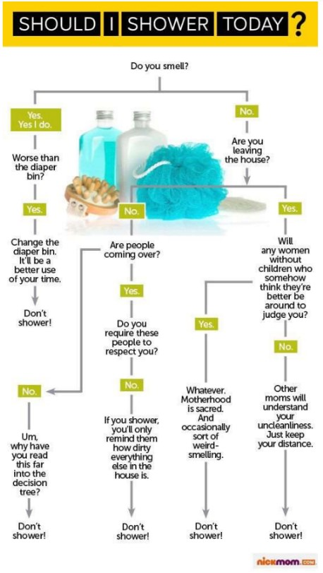
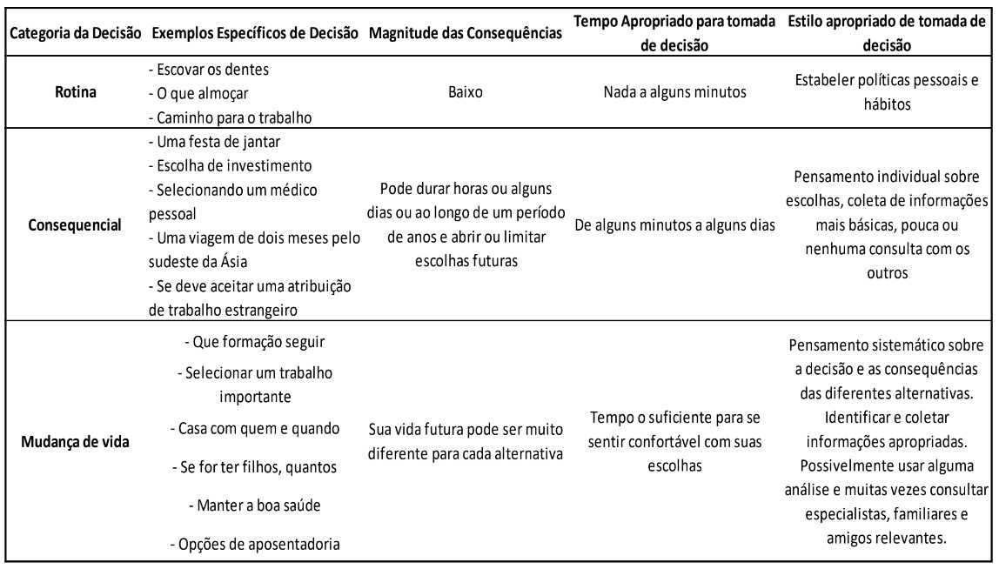
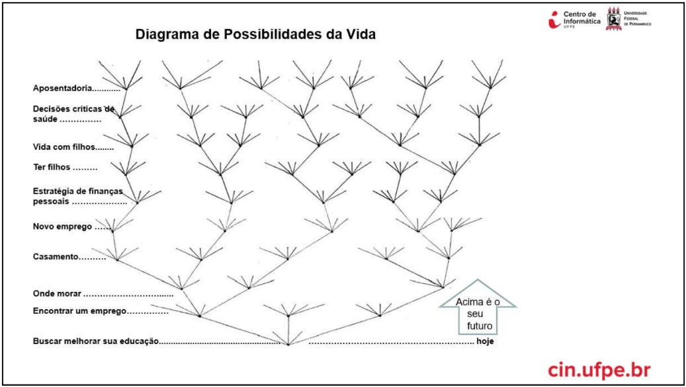
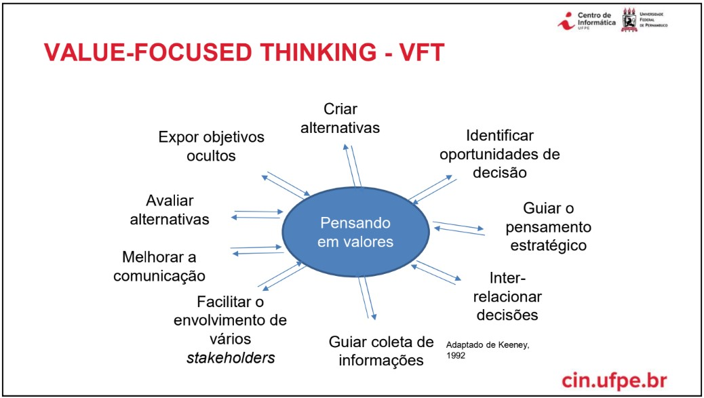
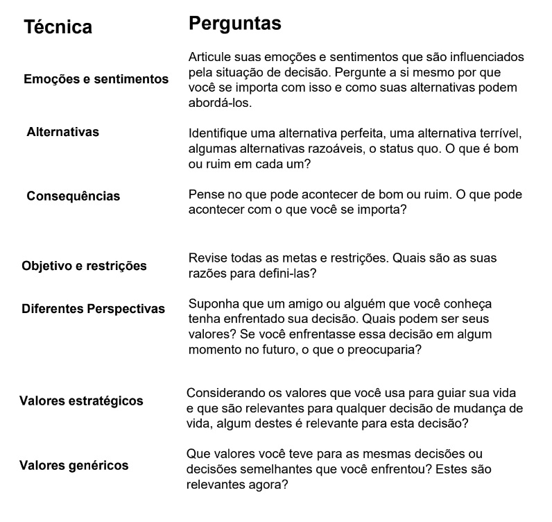
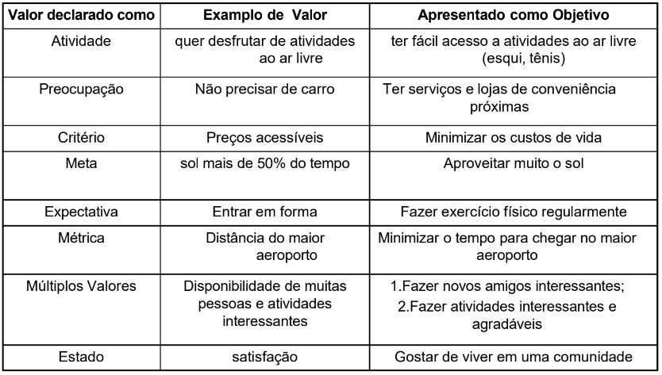

### Métodos de Estruturação de Problemas

O livro “The theory of games and economic behavior” (von Neumann & Morgenstern, 1944): 

  – Apresentou a representação de jogos em forma extensiva (etapas sucessivas) 
  
  – As bases da teoria da utilidade
  
 Bibliografia:
 
 Livro - Thinking Fast and Slow (daniel kahneman)
 
 Livro - "Customers are busy, lazy and ofter confused, they are surprisingly likely to take whatever option is made the default." - Richard thaler
 
 
 
 Livro - Decisions with Multiple Objectives Preferences and value Tradeoffs - Ralph L. Keeney, Howard Raiffa
 
 Livro - Value-Focued Thinking a path to creative decisionmaking - Ralph L.Keeney
 
 Livro - SMART CHOICES A practical guide to making better decisions - Jonh s. Hammond, Ralph L. Keeney, Howard Raiffa
 
 Livro - Give Yourself a Nudge Helping Smart People Meke Smarter Personal and Business Decisions - Ralph L.Keeney
 
 
### VALUE-FOCUSED THINKING - VFT

- O processo de tomada de decisões pode causar

  – preocupação, ansiedade e estresse. 
  
  – Ter dúvidas sobre seu processo de decisão e a própria escolha. 
  
  – arrependimento devido às suas escolhas e/ou decepção com as consequências da decisão. 
  
- Além disso, a tomada de decisão requer tempo e esforço!!!

- Apesar disso, é importante tomar decisões para influenciar as escolhas (do seu ambiente de trabalho, por exemplo) para a melhor. 

- Tomamos decisões todos os dias na nossa vida cotidiana... 

-   E estas representam o **poder** que nós temos de **melhor nossa qualidade de vida**.

- Existem inúmeras possibilidades para sua vida que você cria com suas
decisões 

    – considerando dez decisões de mudança de vida, cinco alternativas cada, haveria cerca de dez milhões de vidas distintas possíveis

- As decisões que você toma agora podem ter um grande impacto nas decisões que você enfrentará no futuro. 

- Você pode criar proativamente oportunidades de decisão agora que influenciam o conjunto de decisões futuras que você enfrentará

- Numerosas circunstâncias exógenas causadas por outros ou pela natureza afetam significativamente as decisões que você enfrenta e suas consequências. •

- Não há sentido em tentar ilustrar um diagrama de possibilidades de vida e selecionar a melhor vida entre estas. 

- No entanto, o tempo e o esforço para tomar decisões devem ser equilibrados com o tempo para experimentar e aproveitar as consequências dessas decisões

De onde vêm os problema de decisão?

- Outros - Concorrentes, governo, patrões

- Acontecimento - acaso, mal-entendidos

- Nossas ações sem pensamento

Por que pensamos neles como problemas?

- Não controlamos suas origens

- Devemos reagir

- Parece estranho que as palavras decisão e problema estejam tão entrelaçadas no uso diário. 
  – Dizemos ‘tenho um problema de decisão’. 
  
- Mas nossas decisões são a única maneira intencional de influenciar qualquer coisa. 
  – são oportunidades de mudanças para melhor em nossas vidas, organizações, comunidades, países e planeta.
  
Então todas as decisões não são problemas?

- Alguns são...

- Outros não!

- Se você cria uma decisão para enfrentar, então ela pode ser vista como uma **oportunidade** de decisão

- Mas o que são **valores**?

  - Eles especificam o que é importante nas decisões que você toma;

  - Indicam o que você espera alcançar ao tomar aquela decisão
 
  - Deixam claro o significado do que é melhor para você naquele contexto de decisão

##### Os valores são o motivo de ficarmos pensando na decisão!

E como as decisões são tomadas?

  - O processo padrão de Tomada de Decisão:

    - Ocorre um problema

    - Identificam-se as alternativas (muitas vezes apenas aceita-se)

    - Avaliam-se as alternativas e escolher

- Este processo de **Tomada de decisão com foco na alternativa** é reativa e inversa. 
  
  – É uma reação a um problema que ocorreu. 
  
  – É inversa porque se concentra em alternativas antes de ser claro sobre o que a decisão deve alcançar. 
  
- Alternativas são meios para alcançar seus valores, então **comece com valores**.

- Uma abordagem de decisão mais útil e capacitadora é baseada em seus valores. 

- Para um problema de decisão ou uma oportunidade de decisão: 

  – comece com seus valores: seu primeiro pensamento consciente deve ser sobre seus valores. 
  
  – Seus valores, então, guiam tudo o que você faz em relação a essa decisão. 
  
- Isso é **Tomada de Decisão Focada em Valor** (VALUE-FOCUSED THINKING). 
  
  – É uma tomada de decisão proativa e com visão de futuro.
  
  
- Para aprender habilidades (praticar esportes, tocar instrumentos musicais, pintura, cozinhar) 

  – Nós as dividimos em pequenos elementos que são necessários para nos tornarmos habilidosos. 

  – Em seguida, tentamos dominar cada um dos elementos mais simples pelo estudo e pela prática. 

  – Uma vez que tenhamos aprendido os diferentes elementos individualmente, praticamo-los em pares e, eventualmente, todos juntos.
  

- A tomada de decisão é uma habilidade importante. 

- Contudo, 

  – a maioria das pessoas não conhece os elementos, 
  
  – eles certamente não os aprenderam formalmente, então

  – eles não podem praticar usá-los.
  
  
 
- Os elementos comuns da tomada de decisão envolvem:
  
  – criar decisões que você gostaria de enfrentar, 
  
  – definir as decisões que você enfrentará, 
  
  – gerar alternativas, 
  
  – especificar objetivos, 
  
  – identificar escalas ou métricas para medir o alcance dos objetivos por alternativas, 
  
  – compreender as possíveis consequências das alternativas, 
  
  – reconhecer incertezas relevantes, e

  - fazer julgamentos de valor para equilibrar a realização de diferentes objetivos.

(Há também subelementos de cada um desses aspectos)

- Tomar decisões de qualidade, como acontece com outras habilidades, requer prática! 

- Você pode continuar melhorando com mais prática (ou seja, experiência). 
 
- E normalmente fica mais fácil tomar decisões com mais proficiência quando você tem mais prática.

- Se você **não** sabe o que quer alcançar tomando uma decisão, é <u>impossível pensar na melhor forma de alcançá-lo.</u> 

- A regra principal de qualquer processo de decisão coerente é “entender com o que você se importa em relação à decisão que enfrenta”. 

- Valores que deem significado para as consequências de suas decisões.

- Quando seus valores são explicitados:

– eles estabelecem uma base para avaliar as possíveis consequências de cada alternativa e

– fornecem orientação para sua decisão.

- Em suas decisões, os valores relevantes são seus valores. 
 
- Seus valores devem ser gerados inicialmente pelo seu pensamento ou por uma sugestão de outro indivíduo (amigo ou profissional). 

- A fonte de seus valores é a coleção de todas as experiências de
sua vida.

- Mas não é fácil fazer isso!

- Para problemas de decisão reais: 
  
  – Os indivíduos podem identificar menos da metade de seus objetivos 
  
  – Eles deixam de identificar objetivos aproximadamente tão importantes quanto os identificados

- É importante dedicar um sério esforço à especificação de objetivos

- Processo para identificar valores:

1. Crie uma lista de desejos. Inclua todos os valores que você espera alcançar na situação de decisão.

2. Estimule valores adicionais usando técnicas de sondagem da mente.

3. Peça que outras pessoas sugiram valores

4. Use valores identificados para identificar valores adicionais

- Usando sondagem da mente:

- E para identificar valores adicionais, se pergunte para cada um dos valores listados:

  1. Por que este valor é importante?

  2. O que este valor significa?

  3. Qual a categoria deste valor?
  
  
- É útil declarar valores no formato de um objetivo. 

- Um valor é qualquer coisa com que um decisor se preocupa em uma decisão

- Um objetivo é um valor declarado em um formato verbo-objeto, por exemplo

  – 'dinheiro' se torna 'maximizar meu salário' ou 'maximizar lucros' 

  – ‘muito gelo derretido’ pode se tornar ‘preservar o habitat do urso polar’
  

