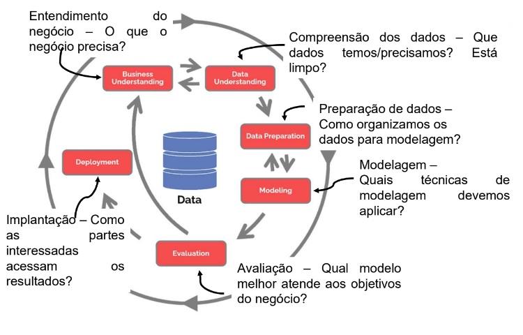

## Métodos de Estruturação de Problemas

### Introdução

- Como um campo novo, muito tem sido escrito sobre o uso de algoritmos de ciência de dados que podem gerar resultados úteis

- Muitos pesquisadores e praticantes têm focado em desenvolver análises avançadas.

- Não surpreendentemente, a pesquisa em ciência de dados normalmente se concentra em melhorar os **modelos de dados** e os **algoritmos** usados em projetos de ciência de dados.

- Mas para usar a ciência de dados em um contexto organizacional existem desafios adicionais que **vão além** dos algoritmos

- Esses desafios incluem itens como:

  - Entender quais dados podem estar disponíveis

  - Quais podem ser os objetivos do esforço;

  - Qual estrutura de gerenciamento de projetos deve ser usada;

  - Como engajar e coordenar os esforços desenvolvidos

  - Como estabelecer cronogramas de projeto realistas

- Kelly e Kaskade (2013) fizeram uma pesquisa com 300 empresas que trabalham com Big Data e certificam que "55% dos projetos de ciência dados não são concluídos e muitos outros ficam aquém de seus objetivos".

- Foi sugerido que uma melhoria no processo de ciência de dados ajudar a melhorar a taxa de sucesso desses projetos (Saltz, 2015).

- No entanto, também foi observado que são necessárias várias metodologias de processo de ciência de dados, com base nos atributos do projeto (Ahangama & Poo, 2015)

- Mas no que consiste um Projeto de Ciência de Dados???

- Ele pode ser descrito como

"um projeto que usa técnicas estatísticas e de aprendizado de máquina em grandes volumes de dados não estruturados e/ou estruturados gerados por sistemas, pessoas, sensores ou rastros digitais de informações de pessoas."

- Este trabalho é feito em um ambiente computacional com o objetivo de identificar correlações e relações causais, classificar e prever eventos, identificar padrões e anomalias e inferir probabilidades, interesse e sentimento.

- Big Data é muitas vezes pensado como um subconjunto da ciência de dados, onde a quantidade de dados requer o uso de ferramentas e algoritmos especiais.

- Projetos de Big Data têm sido frequentemente descritos por meio dos "4 Vs" (Beyer, 2011; IBM, 2013):

  - volume (tamanho dos dados a serem analisados - a equipe precisa usar técnicas de "Big Data")
  
  - variedade (número de fontes e tipo de dados - estruturados, não estruturados ou ambos)
  
  - velocidade (velocidade dos dados coletados/gerados que precisam ser analisados)
  
  - veracidade (a confiabilidade dos dados).
  
- Mas será que esses 4 Vs são suficientes?

- Esses critérios e outros, como fontes de dados, armazenamentos de dados, data staging e processamento de dados, podem ser úteis para descrever os dados usados em um projeto de Big Data.

- Mas muitas vezes é preciso mais para descrever completamente outros atributos sobre o projeto.

- Vamos tomar como exemplo o CRISP-DM (Cross Industry Standard Process for Data Mining), que é um modelo de processo de mineração de dados.

- Ele é um modelo de processo com seis fases que descreve naturalmente o ciclo de vida da ciência de dados.

- É como um conjunto de proteções para ajudar a planejar, organizar e implementar seu projeto de ciência de dados (ou aprendizado de máquina).

- Foi publicado em 1999 para padronizar os processos de mineração de dados em todos os setores.

- Se tornou a metodologia mais comum para projetos de data mining, analytics e data science

- A metodologia pode ser combinada com outras metodologias de gerenciamento de projetos.

- E mesmo sem implementar integralmente, é possível obter benefícios.

