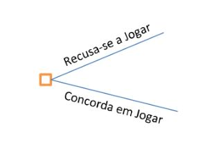
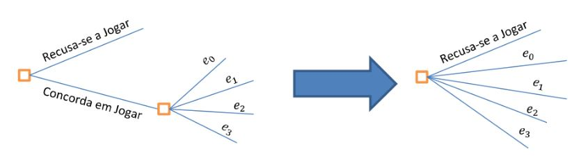
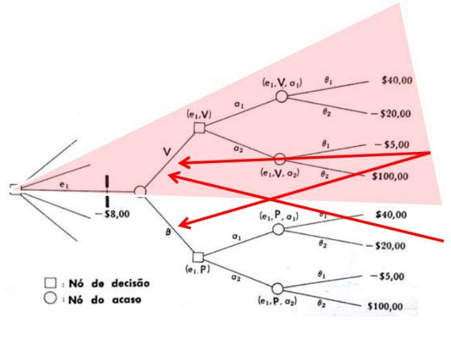
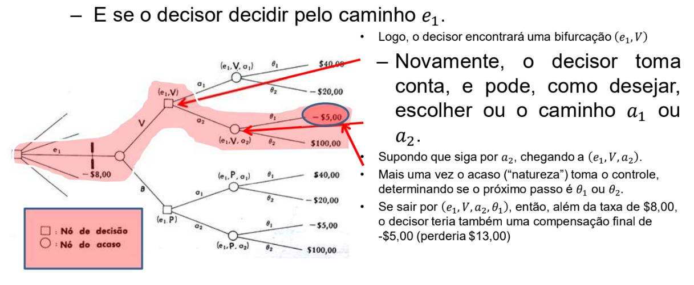
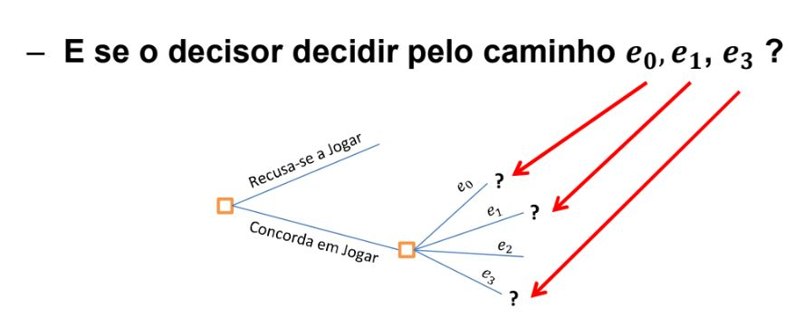
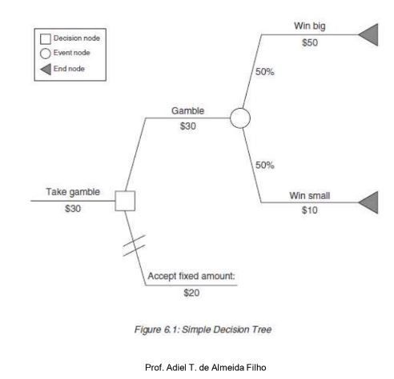
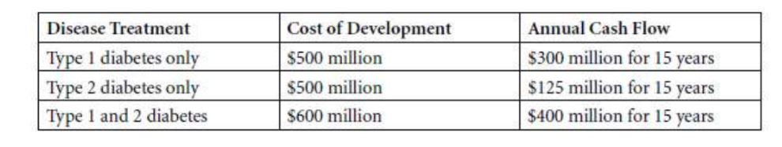

# Teoria da Decisão: Árvore de Decisão

## Diagrama de Fluxo de Decisões

• Árvore de Decisões

  – Análise qualitativa

    - Avaliação cronológica das escolhas:

      – Controladas pelo decisor;

      – Determinadas pelo “acaso”
  
  – No exemplo da urna, tem-se logo de início: participar ou não do jogo.
  
  
  
  
- Árvore de Decisões

  – No exemplo da urna, tem-se logo de início: participar ou não do jogo.
  
    - Se você não se recusar a participar do jogo, então deve decidir se colhe mais informação.
    
    - O decisor pode fazer:
    
      – Nenhuma observação (e0)
      
      – Uma única observação (e1)
      
      – Um par de observações (e2)
      
      – Ou experimentar sequencialmente (es)
      
  
      
      
 - Árvore de Decisões

  – E se o decisor decidir pelo caminho e1.
  
    

- Depois de pagar $8,00 (taxa de amostragem – experimentação), o decisor encontraria uma encruzilhada, com o ramo marcado V (vermelho) e P (preto).

  – Neste ponto, o decisor não tem mais poder sobre o próprio destino
  
• Suponha então que, por acaso, o decisor retire uma bola vermelha da urna não identificada, e portanto se dirija pelo caminho V
  
      
  

  

• Existem situações onde o risco não é apenas discreto, como também assume caráter sequencial

• Nessas situações depende-se de decisões sequenciais e processos estocásticos encadeados

• Para este tipo de situação pode ser utilizada a técnica de Árvores de Decisão

• As árvores de decisão permitem considerar o risco em diversos estágios e prover respostas para os resultados obtidos em cada um destes

### Componentes da análise com árvores de decisão

- **Nó raiz**: representa o início da árvore de decisão, onde o decisor está diante de uma decisão ou de um resultado incerto. A ideia é obter o valor do investimento de risco neste nó

- **Nós de evento**: representam os possíveis resultados de uma aposta ou processo estocástico

- **Nós de decisão**: representam escolhas que o decisor pode tomar, exemplo seguir com um investimento após pesquisa de mercado

- **Nós de fim**: são os desfechos das decisões tomadas em reação aos desfechos prévios

 

### Etapas para análise de uma árvore de decisão

1. Dividir a análise em fases de risco (geração de cenários)

2. Estimar as probabilidades dos resultados em cada fase

3. Definir os pontos de decisão

4. Calcular os fluxos de caixa e os valores nos nós de fim

5. Executar o caminho inverso da árvore (Fold Back)

### A árvore de decisão permite encontrar dois dados chave:

• Valor esperado para hoje obtido ao se percorrer a árvore de decisão, considerando potenciais perdas e oportunidades de risco e as ações a serem tomadas

• A faixa de variação de valores nos nós de fim que contém o risco em potencial de um investimento

### Considere o problema do investimento no desenvolvimento de uma droga para diabetes

  • Para o desenvolvimento de uma droga que passou pelo teste pré-clínico, o FDA requer 3 etapas para a aprovação da droga:

    1. A primeira etapa requer custos de 50 milhões e envolve 100 voluntários para determinar a segurança e a dosagem do medicamento. A duração prevista para essa etapa é de 1 ano. As chances de que o medicamento tenha sucesso nessa etapa é de 70%

    2. Na segunda etapa o medicamento é administrado em 250 voluntários para testar sua eficácia em um período de 2 anos. Essa etapa custa 100 milhões e o medicamento precisa demonstrar impacto estatisticamente significativo para passar para a fase 3. As chances de sucesso para diabetes tipo I são 30%, de sucesso para diabetes tipo I e II de 10% e apenas para diabetes II chance de sucesso de 10%.
    
    3. Na terceira etapa os testes são feitos com 4 mil voluntários para determinar as consequências no longo prazo da droga. Se ela é testada apenas contra diabetes I ou II, essa etapa dura cerca de 4 anos e custa 250 milhões e as chances de sucesso são de 80%. Se for testada contra os dois tipos de diabetes, essa fase dura 4 anos e custa 300 milhões e a chance de sucesso é de 75%.

- A tabela abaixo mostra os custos do desenvolvimento do medicamento e os fluxos de caixa anuais se ele passar pelas 3 etapas

- Considerando uma TMA de 10% a.a.

### Vantagens do uso de árvore de decisão

- Resposta dinâmica ao risco

- Value of Information

- Gestão do Risco e ações preventivas - hedge
