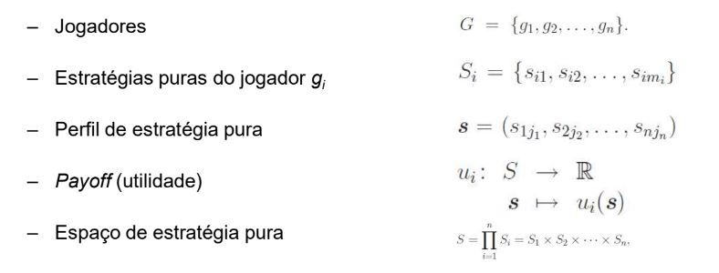
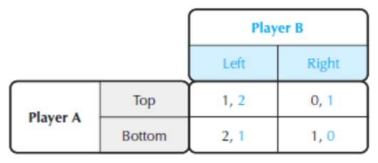
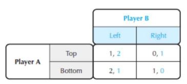
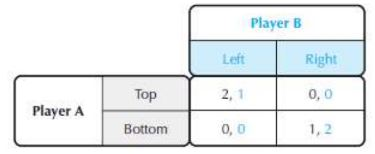
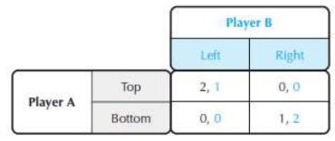
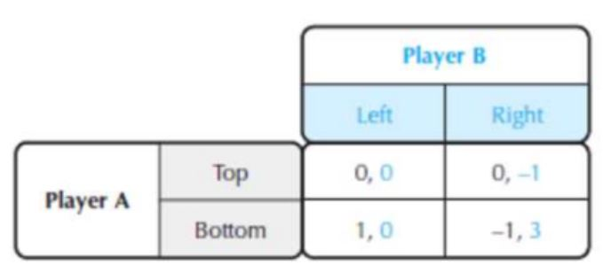
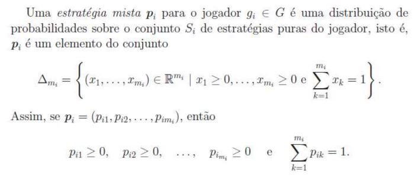
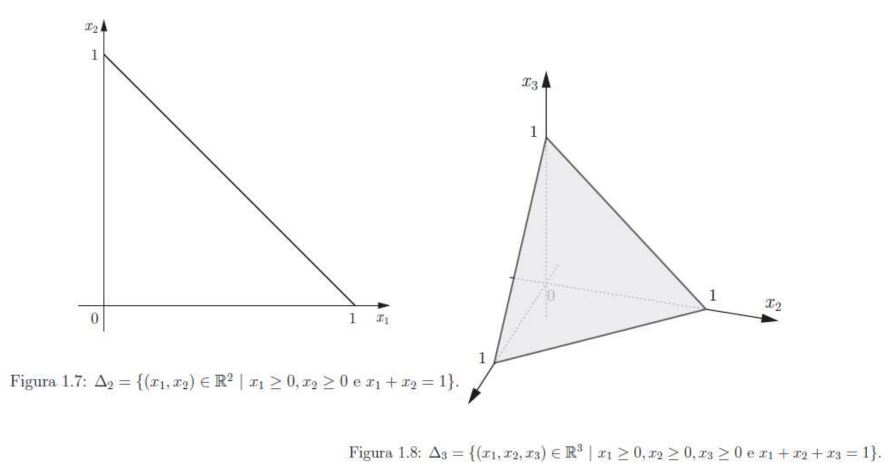

## Teoria dos Jogos

Os jogos estão presentes em nosso dia a dia de uma forma lúdica e natural

- É engraçado verificar que a maior parte das pessoas não considera que os jogos
sejam algo a ser estudado seriamente

- No entanto, com frequência tratamos como se fossem jogos atividades bem mais
sérias do que aquelas de lazer

  – Ex: “O jogo da política internacional” (ou nacional), “O jogo da livre concorrência”, etc...

- Parece então haver alguma relação entre “negociações internacionais”, “decisões
estratégicas de executivos de empresas” e “uma partida de xadrez”

#### Interação estratégica

- Interação estratégica é aquela em que participantes, sejam indivíduos ou
organizações, reconhecem a interdependência mútua de suas decisões

- Então sempre que um conjunto de indivíduos ou empresas estiver
envolvido em uma situação de interdependência recíproca pode se dizer
que se encontram num “jogo”

  – Situações onde as decisões tomadas influenciam-se reciprocamente
  
  

#### Teoria dos Jogos vs Teoria da Decisão

- Observe que na “Teoria dos Jogos” temos uma teoria para decisões num contexto
diferente da “Teoria da Decisão”

  – Teoria da Decisão: o decisor joga com a incerteza ou aleatório, que não possui
uma racionalidade específica

  – Teoria dos Jogos: o decisor joga com outro decisor racional

- Esta racionalidade portanto possui implicações... 

  – “Não é que as pessoas estejam contra você. É que elas estão a favor delas próprias” (Gene Fowler, biógrafo e jornalista norte americano)

#### Escolha racional

- Um decisor escolhe a melhor estratégia entre todas as estratégias disponíveis para ele

- Com isto a teoria dos jogos constrói modelos matemáticos para representar conflitos e cooperação entre decisores racionais

- Principais elementos da abordagem da escolha racional: os indivíduos têm objetivos os quais buscam alcançar

  – O valor moral dos objetivos dos indivíduos não é julgado
  
  – Os indivíduos têm algum grau e liberdade de escolha; eles escolhem ações que lhes permitirão alcançar seus objetivos (maximizar o valor esperado dos seus ganhos)
  
- Os ganhos dos indivíduos são medidos em escalas de utilidade

### Breve Histórico da Teoria dos Jogos

- Cournot (1938):

  – Apresentou em seu livro o famoso modelo de duopólio que hoje leva seu nome, neste modelo duas empresas que oferecem um bem similar decidem que quantidade produzir e ofertar o mercado
  
  – O método empregado por Cournot é um dos precursores para análise de equilíbrio em jogos não-cooperativos, adiante formalizado por Nash
  
- Zermelo foi o matemático alemão que trouxe a perspectiva de uma estratégia vencedora para o xadrez com uma abordagem da teoria dos jogos através da técnica de “indução reversa”

- Borel relacionou questões de “sorte” (incerteza) com a habilidade do jogador para definir um “método de jogo”

  – Foi o primeiro a formular o conceito de estratégia em teoria dos jogos

- O matemático John von Neumann formulou a teoria dos jogos e provou a solução
matemática para “jogos de soma zero”

  – Num jogo de soma zero, os ganhos de um jogador representam necessariamente uma perda para o outro
  
  – O livro “The theory of games and economic behavior” (von Neumann & Morgenstern, 1944) apresentou a representação de jogos em forma extensiva (etapas sucessivas)

  - Também discutiu cooperação e formação de coalizões entre jogadores, mas
limitando-se a jogos de soma zero

- O jogo de soma zero não é a descrição adequada para um grande número de
interações sociais, para algumas situações são inadequadamente restritivos

  – Era necessário encontrar ferramentas teóricas que permitissem analisar uma
variedade maior de modelos de interação estratégica

- A partir de 1950 novos modelos foram desenvolvidos por John Nash, John Harsanyi
e Reinhard Selten, premiados com o Nobel de Economia em 1994

  – As contribuições de Nash, Harsanyi e Selten foram essenciais para a difusão da Teoria dos Jogos e para a modelagem matemática de inúmeros problemas da
sociedade

- John Nash foi um matemático norte-americano, sua biografia rendeu o filme “Uma
mente brilhante”

- Em 1951, Nash publicou o artigo “Non-cooperative games” onde propôs uma noção
de equilíbrio para modelos de jogos que não se restringia apenas aos jogos de soma zero

  - Equilíbrio de Nash: permitiu estudar uma classe de jogos muito mais ampla do
que os jogos de soma zero

- Harsanyi deu grandes contribuições com 3 artigos tratando situações de jogos com informações incompletas, onde alguns jogadores possuem informação privilegiada
  
   – Mostrou que o equilíbrio de Nash poderia ser estendido para modelos com
informação incompleta ou assimetria de informação

### Exemplos de Jogos

- Dilema do prisioneiro

- “Chicken Game”

- Batalha dos sexos

- Coexistência

- Barganha

- Ultimato

- Batalha do Mar de Bismark

- Votações

- Formação de preço em concorrências

- Restrições na produção de petróleo da OPEP

- Lançamento de uma nova empresa ou fábrica

- Aquisição hostil de uma empresa

- Leilões de privatizações

- Ações de agências reguladoras

- Muitos outros...

### Caracterização de um jogo

- A análise de qualquer jogo ou situação de conflito deve se iniciar com a
especificação de um modelo que descreva o jogo

- Assim, a forma ou estrutura geral dos modelos que utilizarmos para descrever jogos deve ser cuidadosamente considerada

- Uma estrutura de modelo que seja simples demais pode nos forçar a ignorar
aspectos vitais dos jogos

- Uma estrutura de modelo excessivamente complicada pode impedir nossa análise,
obscurecendo as questões essenciais

- Um jogo nada mais é do que uma representação formal que permite a análise das
situações em que os agentes interagem entre si, agindo racionalmente

- Elementos que caracterizam um jogo:

  – **Modelo do jogo:** descrição e análise
  
  – **Interações**: as ações de cada agente (individualmente) afetam os demais
  
  – **Agentes / Jogadores**: é qualquer indivíduo ou grupo com capacidade de decisão para afetar os demais
  
  – **Racionalidade**: os agentes empregam os meios adequados aos objetivos que
almejam

  – **Comportamento estratégico**: cada jogador ao tomar sua decisão leva em
consideração a interação com os outros jogadores e as consequências das múltiplas
decisões em conjunto

- Existem duas formas de representar um jogo:

  - Forma normal
  
  - Forma estendida
  
- Elementos básicos

### Matriz de Payoff de um Jogo

- Um jogo pode envolver múltiplos jogadores e múltiplas estratégias

- Mas aqui vamos considerar o caso ilustrativo de jogos com dois jogadores e um
número finito de estratégias

  – Dessa forma podemos ilustrar facilmente a matriz de payoff
  
- Suponha que num jogo simplificado simultâneo:

  – O jogador A vai escrever uma de duas palavras num pedaço de papel: “Acima”
ou “Abaixo”

  – O jogador B vai de forma independente e simultânea escrever no papel:
“Esquerda” ou “Direita”

  – Em seguida os papeis serão examinados, então teremos a matriz de payoff

- A matriz de payoff pode ser representada assim:

- Estas escolhas podem representar situações como:

  – “aumentar o preço” ou “diminuir o preço”
  
  – “lançar um novo produto” ou “criar uma versão melhorada”
  
  – “declarar guerra” ou “retaliar economicamente/diplomaticamente”
  
  
- Este jogo apresentado tem uma solução muito simples:

  – Para o jogador A, sempre será melhor escolher “Abaixo”

  – Para o jogador B, sempre será melhor escolher “Esquerda”
  

- Existe uma relação clara de dominância nessa matriz para cada jogador

- A condição de equilíbrio sempre será “Abaixo” e “Esquerda”

- Uma **estratégia dominante** é representada pela escolha ótima para cada jogador, independentemente da ação do outro

- Portanto, estas escolhas dominam as outras opções resultando num equilíbrio de
estratégias dominantes

- Se existe uma estratégia para cada jogador, então podemos prever que este será o resultado de equilíbrio do jogo

- Para este jogo:

  – Jogador A sempre jogará “Abaixo”, recebendo 2

  – Jogador B sempre jogará “Esquerda”, recebendo 1
  
### Equilíbrio de Nash

- Equilíbrio de estratégias dominantes são situações confortáveis, mas não acontecem frequentemente

- Observe o jogo abaixo:

- Neste caso, a escolha ótima para o jogador A depende o que ele pensa que o
jogador B vai fazer

## Equilíbrio de Nash

- Equilíbrio de estratégias dominantes são situações confortáveis, mas não acontecem frequentemente

- Observe o jogo abaixo:

- Neste caso, a escolha ótima para o jogador A depende o que ele pensa que o
jogador B vai fazer

- O equilíbrio de estratégias dominantes é uma situação muito exigente

- Ao invés de exigir que a escolha do jogador A seja ótima para todas as escolhas do jogador B, podemos considerar as escolhas ótimas do jogador A dado uma escolha do jogador B

  – Podemos assumir que B é racional e “bem informado”
  
  – No entanto, o que é ótimo para B também depende da escolha de A
  
- O **Equilíbrio de Nash** será representado por um par de estratégias

  – Se a escolha de A é ótima dado a escolha de B, e B é ótimo dado a escolha de A
  
  – Lembre que A e B não sabem qual a escolha de seus oponentes!

- O Equilíbrio de Nash pode ser interpretado como um par de expectativas sobre a
escolha de cada jogador

- Quando uma escolha é revelada, nenhum jogador mudará seu comportamento

- O Equilíbrio de Nash é uma generalização do Equilíbrio de Cournot

  – O Equilíbrio de Cournot considera a decisão entre concorrentes sobre o quanto
produzir, onde cada firma decide o quanto produzir considerando a decisão do
concorrente

- A lógica do Equilíbrio de Nash é interessante, no entanto tem alguns problemas

  – Um jogo pode ter mais de um Equilíbrio de Nash, o que ocorre em jogos
simétricos

  – Existem jogos que não possuem Equilíbrios de Nash conforme descrevemos
através de estratégia pura, a não ser que esta noção seja expandida para
estratégias mistas

## Estratégias mistas

- Uma outra perspectiva é permitir que os agentes randomizem suas estratégias

- Ao associar probabilidades para suas escolhas, os jogadores podem construir
estratégias mistas

- Ao calcular o valor esperado das estratégias de cada jogador, é possível obter um Equilíbrio de Nash no qual cada agente escolhe a frequência ótima para jogar considerando as frequências dos outros agentes

- É possível provar matematicamente que sempre haverá um Equilíbrio de Nash para
estratégias mistas

– Por isso é tão importante entender o comportamento do jogo

Observe este jogo:

- Neste jogo não existe Equilíbio de Nash em estratégias puras

- Suponha que A escolha uma estratégia que consiste em 50% para cada ação, e que
B escolha os mesmos percentuais:
  
  – O payoff médio de A será 0 e B será 1⁄2
  
- O Equilíbrio de Nash ocorre com as probabilidades 3⁄4 para “Acima” 1⁄4 para “Abaixo”, 1⁄2 para “Esquerda” e 1⁄2 para “Direita”

- Um exemplo clássico para um jogo de estratégias mistas é o jogo do “Papel, Pedra e Tesoura”

  – Existe uma sociedade que organiza campeonatos profissionais!

    - Procurem o documentário de 2003 sobre os campeonatos em Toronto
    
- Considerando que os humanos não são randomizadores perfeitos, assim como no Pôquer é possível verificar alguns padrões

### O Dilema do Prisioneiro

28
