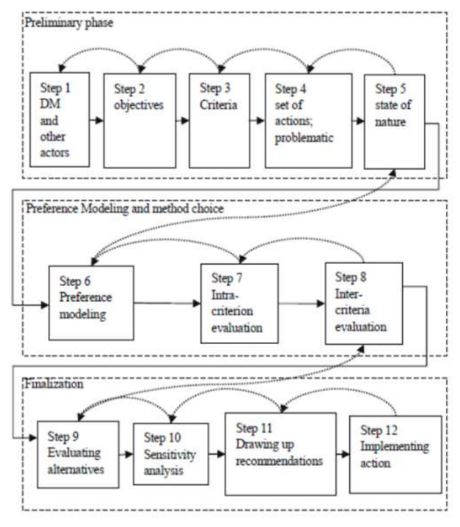

# Métodos de Apoio Multicritério a Decisão

- Um problema de decisão multicritério é uma situação onde existem:

  – Pelo menos dois cursos de ação para se escolher
  
  – A decisão é realizada de modo a atender a diferentes objetivos, muitas vezes conflitantes entre si

  – É necessário racionalizar sob valores em diferentes escalas ou atributos que requerem um tratamento especial para serem comparados em conjunto
  
- Em problemas que envolvem grande quantidade de critérios, normalmente não existe a possibilidade de se chegar a uma solução unânime e ótima, pois diferentes objetivos e preferências resultam em diferentes resultados

##### Classificação

- Problemas de decisão multicritério podem ser classificados em diferentes tipos (Roy, 1996):

  – Problemática de Escolha
  
  – Problemática de Classificação
  
  – Problemática de Ordenação
  
  – Problemática de Descrição
  
  – Problemática de Portfólio (caso especial da Problemática de Escolha)
  
  

#### Métodos Multicritério

- Doumpos & Zopounidis (2014) distinguem entre quatro tipos de abordagens multicritério:

  – Otimização Multiobjetivo / Métodos Interativos
  
  – Teoria de Valor / Utilidade Multiatributo / Critério Único de Síntese

  – Relações de Sobreclassificação / Métodos de Sobreclassificação

  – Análises de Desagregação de Preferências

#### Otimização Multiobjetivo

- A Otimização Multiobjetivo consiste em abordagens de programação matemática envolvendo mais de um único objetivo do decisor

- É considerada uma extensão aos métodos tradicionais de otimização monobjetivo

- O campo de atuação da abordagem de otimização multiobjetivo contempla problemas complexos, podendo envolver a formulação de heurísticas e algoritmos evolucionários

- Nessa abordagem, existe uma busca por alternativas não dominadas em uma análise da fronteira de Pareto

- A otimalidade das soluções é analisada através da relação de dominância devido ao fato de que não existe uma alternativa que possua o melhor desempenho em todos os critérios ao mesmo tempo

#### Critério Único de Síntese

- Envolvem metodologias que agregam/combinam as performances de cada alternativa para os diferentes critérios de avaliação, de forma que se obtenha um valor global de performance para cada alternativa

- Esse valor é utilizado para comparações entre as diferentes alternativas do problema, e assim, para a tomada de decisão.

- Esses métodos são considerados compensatórios, pois um bom desempenho de uma alternativa para um determinado critério pode compensar um desempenho ruim para um outro critério

  – A compensação é definida pelos tradeoffs (pesos, constantes de escala) dos critérios de decisão

- Destacam-se os métodos provenientes da Teoria de Valor/Utilidade Multiatributo:

  – Modelo Aditivo

  – AHP

  – TOPSIS

  – SMARTS

  – MACBETH

  – FITradeoff

- MAUT difere de MAVT ao tratar problemas sob a perspectiva da existência de consequências probabilísticas

- Considerando-se assim uma modelagem no contexto de incerteza, enquanto MAVT trata de consequências determinísticas

- Ambas abordagens são bem definidas axiomaticamente

- Para estas duas abordagens existem testes de racionalidade que devem ser realizados para validar a adequação dos métodos ao contexto decisório

#### Métodos de Sobreclassificação

#### Aplicação de Métodos Multicritério

