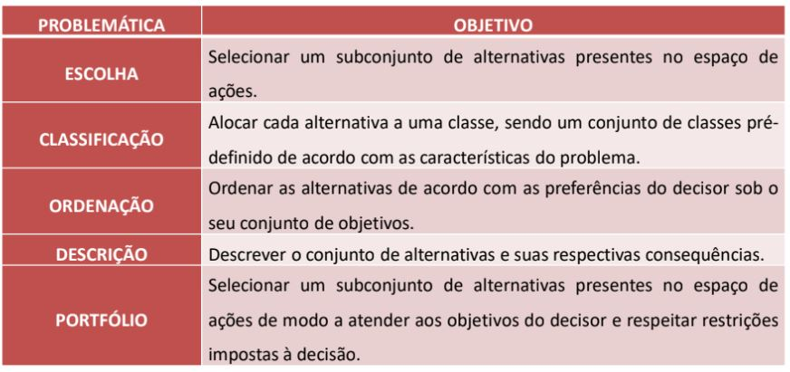

# Métodos de Apoio Multicritério a Decisão

- Um problema de decisão multicritério é uma situação onde existem:

  – Pelo menos dois cursos de ação para se escolher
  
  – A decisão é realizada de modo a atender a diferentes objetivos, muitas vezes conflitantes entre si

  – É necessário racionalizar sob valores em diferentes escalas ou atributos que requerem um tratamento especial para serem comparados em conjunto
  
- Em problemas que envolvem grande quantidade de critérios, normalmente não existe a possibilidade de se chegar a uma solução unânime e ótima, pois diferentes objetivos e preferências resultam em diferentes resultados

##### Classificação

- Problemas de decisão multicritério podem ser classificados em diferentes tipos (Roy, 1996):

  – Problemática de Escolha
  
  – Problemática de Classificação
  
  – Problemática de Ordenação
  
  – Problemática de Descrição
  
  – Problemática de Portfólio (caso especial da Problemática de Escolha)
  
  
