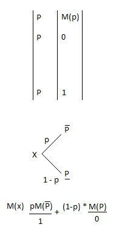

Começa a analisar uma arvore de traz para frente


============================

Arvore de Decisão

F = c * (1 + e)^n

P = C/(1 + e)^n

exercício

1 - Vai calcular cada triangulo

2 - no exel (função PNT)

===========================



===========================

- Deve tomar cuidado com informações do tipo: dados com mais de 3 desvios padrões deve ser apagados. Ex: Pessoas mortas na COVID


- six sigma: de cada 1.000.000 um dá problema

quando você está apagando algum dado da base você tem que realmente identificar o que está fazendo (na maioria das situações você tem que verificar a referencia desses eventos)


=====================
Teoria da decisão não responde tudo

```
a conte é melhor fazer. (quanto custa uma vida?) - 2.000.000 o custo de uma vida (segundo sei lá os ingleses).
No brasil muitas mulheres morrem por não fazer uma mamografia
- quem tem dinheiro para entrar na justiça entra em uma fila
```


======================

prospecto - é uma consequência probabilística (uma chance de ganho e uma chance de perda)

Se você faz uma pergunta e ela é tendenciosa a ser pessimista, as pessoas tendem a ser negativas. Se uma pergunta tende a ser positiva, a pessoa tende a responder de forma positiva.

Loteria - algo que vai representar uma distribuição de probabilidade

~ -> Indiferente 


```
Prova de SAD (Vai até teoria dos jogos)
 - Arvore de decisão
 - Teoria de utilidade
 - Modelagem
 - Teórico
```


============

OBS

Programação linear:
- Variável de excesso 
- Variável de folga

No computador o sinal de <=é tratado como ==. O < é tratado como uma variável artificial. (ou seja <= tem o mesmo tempo de processamento do ==)

"Se for realizar um problema no computador usando solver pode dá error por conta disso"
Buscar: Excel (solver)
