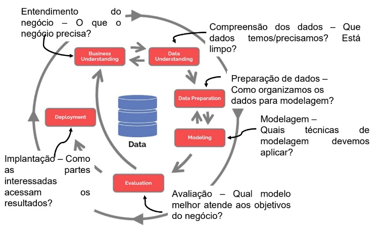
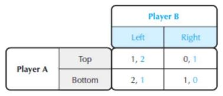
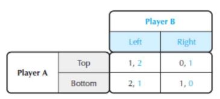
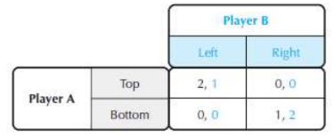
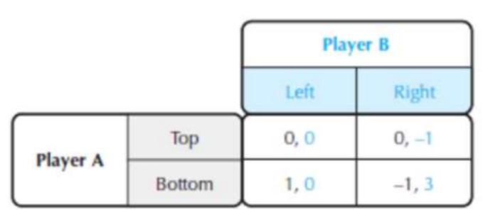
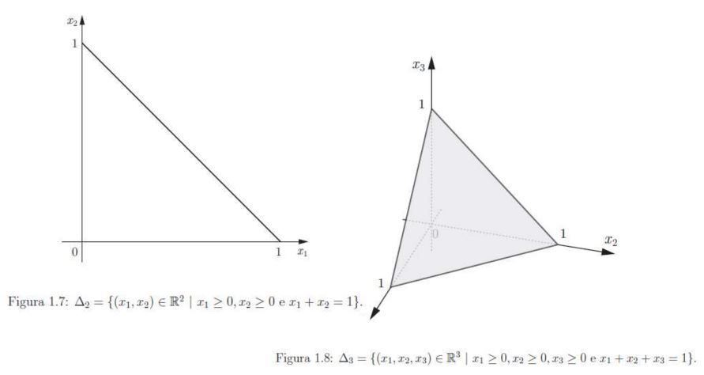

#  1 BASE DE SAD

Sistema de apoio à decisão (SAD) (também conhecido por Decision Support System (DSS))

### Definição de SAD:

Um sistema de informação consistindo de hardware/software e do elemento humano designado para assistir um tomador de decisão de qualquer nível, com ênfase em tarefas estruturadas e não-estruturadas (um sistema usado para explorar alternativas possíveis que auxiliam na tomada de decisão)

```
O SAD serve para decisões não estruturadas. QUE não é simplesmente programar um sistema, é preciso entender qual a utilidade, designação e estruturar a aplicação. O problema muitas vezes não está formulado ou dado o cliente muitas vezes não sabe o que quer.
 
Cabe a você compatibilizar os aspectos humanos, decisórios, modelos, base de dados… tudo que vai ser necessário para esse problema de decisão.
```

## (Introdução) Características da tomada de decisão

- Pensamento de grupo: Membros do grupo aceitam soluções sem refletir, o que pode levar a decisões ruins

- Avaliação de cenários what-if 

- Experimentação de um sistema real é muito custoso (deveria testar num modelo antes?!?)

- Mudanças no ambiente de tomada de decisão podem ocorrer constantemente: - Isso altera as premissas do modelo! (deve verificar o que é dinâmico e o que não é dinâmico)(por exemplo,(em um sistema tipo ifood) as entregas em dias de feriado podem aumentar, exigindo uma visão diferente do problema).

- Impondo pressão de tempo sobre o decisor.(influencia na qualidade da tomada de decisão)

- A análise de um problema custa tempo/dinheiro: - É difícil fazer o trade-off e decidir o escopo para tomar uma decisão (É difícil determinar quando parar e tomar uma decisão - dependendo do problema você não vai perder tempo com o problema)

- Informação insuficiente ou em abundância isso atrapalha. Informação demais atrapalha porque você não consegue enchergar o que é relevante.


### O SAD envolve quatro tipos básicos de modelagem analítica.

- Análise tipo what if "o que-se".

  O usuário introduz mudanças nas variáveis ou relações e verifica as mudanças resultantes nos valores das outras variáveis
 
  Ex: Se o orçamento com marketing aumentar em 2%, qual será o impacto total nas vendas?

- Análise de busca de metas (busca de objetivo).

  Alterando os valores das variáveis finais (metas) é observada a mudança das outras variávies

  Ex: Quanto se deve gastar com marketing para se gerar R$50.000,00 de vendas totais.

- Análise de sensibilidade.

  É um caso especial da análise what if, onde a mudança repetida de um única variável faz com que sejam observadas as mudanças nas outras variáveis. Permite desenvolver análises aplicando diferentes variáveis.

  Ex: Qual o preço máximo que se deve pagar pela matéria-prima e ainda obter lucro?

- Análise de Otimização.

  É uma extensão da análise busca de metas, onde ao invés de fixar uma meta, a meta é encontrar a solução ótima para uma ou mais variáveis alvo do problema.
  
  Geralmente a otimização é alcançadas através de programação matemática, sendo que às vezes, devido à complexidade do sistema, são adotados modelos heurísticos que usam métodos de inteligência artificial. Os métodos de inteligência arificial muitas vezes não encontram a solução ótima, mas encontram uma solução próxima da ótima

### Conhecimentos para construir um SAD Bem sucedido

A construção de um SAD bem-sucedido requer um conhecimento profundo destes conceitos:

- Support: métodos de apoio a decisão

- Decision Making: aspectos cognitivos que estão envolvidos no aspecto decisório

- System: O que o sistema pode contribuir

- Models and data: Como elaborar modelos e enriquecer através de dados.

### Etapas para um SAD

Processo de 4 etapas conforme proposto por Simon:

- Definição / Estruturação do problema de decisão (oportunidade de decisão)

- Construção de um **modelo** que descreve o problema do mundo real

- Identificação de possíveis soluções para o problema e avaliação de soluções

- Comparação, escolha e recomendação de uma solução potencial para o problema


### 


# 2 Tipos de Decisões


# 3 Fases do processo de decisão


# 4 Modelagem de problemas


# 5 Métodos de estruturação de problemas


# 6 Métodos de estruturação de problemas (VFT e AFT)

Projeto de Ciência de Dados

"um projeto que usa técnicas estatísticas e de aprendizado de máquina em grandes volumes de dados não estruturados e/ou estruturados gerados por sistemas, pessoas, sensores ou rastros digitais de informações de pessoas."

Este trabalho é feito em um ambiente computacional com o objetivo de identificar correlações e relações causais, classificar e prever eventos, identificar padrões e anomalias e inferir probabilidades, interesse e sentimento.

ciclo de vida da ciência de dados



**1. compreensão do negócio -> 2. compreensão de dados -> 3. preparação dos dados -> 4. modelagem -> 5. Avaliação -> 6. Implantação -> 7. Monitoramento**

## VALUE-FOCUSED THINKING - VFT

Os valores são o motivo de ficarmos pensando na decisão!

Mas o que são valores?

- Eles especificam o que é importante nas decisões que você toma;

- Indicam o que você espera alcançar ao tomar aquela decisão

- Deixam claro o significado do que é melhor para você naquele contexto de decisão

### O Processo Padrão de Tomada de Decisão (Tomada de decisão com foco na alternativa):

1. Ocorre um Problema -> 2. Identificam-se as alternativas (muitas vezes apenas aceita-se) -> 3. Avaliam-se as alternativas -> 4. Escolhe

Problema: Este processo é reativa e inversa:

– É uma reação a um problema que ocorreu.

– É inversa porque se concentra em alternativas antes de ser claro sobre o que a decisão deve alcançar. 

(Alternativas são meios para alcançar seus **valores**, então **comece com valores.**)

### VALUE-FOCUSED THINKING - VFT

Uma abordagem de decisão mais útil e capacitadora é baseada em seus valores. 

• Para um problema de decisão ou uma oportunidade de decisão: 

– comece com seus valores: seu primeiro pensamento consciente deve ser sobre seus valores. 
– Seus valores, então, guiam tudo o que você faz em relação a essa decisão.

– É uma tomada de decisão proativa e com visão de futuro.

(26-45) - verificar esse slide

Tomar decisões de qualidade, requer prática.

• Se você não sabe o que quer alcançar tomando uma decisão, é impossível pensar na melhor forma de alcançá-lo. 
• A regra principal de qualquer processo de decisão coerente é “entender com o que você se importa em relação à decisão que enfrenta”. 
• Valores que deem significado para as consequências de suas decisões.

• É importante dedicar um sério esforço à especificação de objetivos

• Processo para identificar valores:
1. Crie uma lista de desejos. Inclua todos os valores que você espera alcançar na situação de decisão.
2. Estimule valores adicionais usando técnicas de sondagem da mente.
3. Peça que outras pessoas sugiram valores
4. Use valores identificados para identificar valores adicionais

VALOR X OBJETIVO

• É útil declarar valores no formato de um objetivo. 
• Um valor é qualquer coisa com que um decisor se preocupa em uma decisão

• Um objetivo é um valor declarado em um formato verbo-objeto, por exemplo:

– 'dinheiro' se torna 'maximizar meu salário' ou 'maximizar lucros' 

– ‘muito gelo derretido’ pode se tornar ‘preservar o habitat do urso polar’

• Objetivo Fundamental: um objetivo que define uma razão básica para se preocupar com uma decisão. 
• Objetivo Meio: um objetivo cuja importância decorre de sua influência na consecução de outros objetivos.


• Os objetivos fundamentais podem ser estruturados em uma
hierarquia
• O objetivo mais geral está no topo
• Objetivos de nível inferior explicam o significado dos objetivos de
nível superior 
• A realização dos objetivos de nível mais baixo pode ser medida
usando “métricas” para descrever e avaliar as várias alternativas


• Somente objetivos fundamentais devem ser usados para avaliar e
comparar alternativas. 
– A realização dos objetivos de nível mais baixo pode ser medida
usando “atributos” para descrever e avaliar as várias alternativas. 
• Significa que os objetivos podem ser usados para criar alternativas
• Se um objetivo é um meio ou um objetivo fundamental depende do contexto de decisão


# 7 Teoria da Decisão 

Metodologia para considerar que as decisões foram tomadas da melhor forma possível (medir a intensidade das alternativas para extrair a melhor decisão)

Precisamos da garantia da racionalidade na tomada de decisão

Dominância estocástica - buscar soluções melhores

A teoria da decisão não surge como uma teoria que tenta descrever ou explicar o comportamento das pessoas (ou instituições) ou como elas tomam suas decisões

– Ela busca organizar de forma lógica parâmetros que possam ajudar na tomada de decisões, face as preferências do agente decisor e ao que se deseja obter.

## Decisão

“Curso de ação escolhido pela pessoa, como o meio mais efetivo à sua disposição, para alcançar os objetivos pretendidos”

E, segundo esta teoria, uma boa decisão deverá ser uma função lógica **daquilo que se quer**, **daquilo que se sabe** e **daquilo que se pode fazer**.” (Souza, 2007)

#### Decisão sob Incerteza 

O decisor Não consegue estimar a probabilidade de orrência dos cenários

#### Decisão sob Risco

Quando o decisor conhece a probabilidade de ocorrência dos cenários, por conseguinte, pode avaliar o risco associado a decisão adotada

#### Perspectiva de Análise da Decisão:

– Descritiva: descreve a realidade das ações como elas são. A física é descritiva porque os modelos da física têm a intensão de descrever a realidade e podem ser comprovados experimentalmente (lei da gravidade)

– Normativa: identifica como as ações deveriam ser

– Prescritiva: quando está prescrevendo uma recomendação específica

### Decisão X Consequência


(As pessoas tem uma dificuldade em entender o que é uma boa decisão. Uma boa decisão é fruto do uso de boas metodologias e de um bom processo decisório)(você pode ter resultados ruins para uma determinada decisão isso não significa que a decisão não teve qualidade - você deu azar. mas que você fez tudo que esteve em seu alcance para tomar a melhor decisão possível)

### Elementos de uma boa decisao


- utilidade: (O nível de desajabilidade que aquela consequencia tem)

- Escala útil: (Escala usada em muitos modelos economicos para mensurar e antecipar muitos comportamentos)


# 8 Arvore de Decisão


# 9 Teoria dos Jogos

### Interação estratégica

– Situações onde as decisões tomadas influenciam-se os participantes reciprocamente

### Teoria dos Jogos vs Teoria da Decisão

– Teoria da Decisão: o decisor joga com a incerteza ou aleatório, que não possui uma racionalidade específica

– Teoria dos Jogos: o decisor joga com outro decisor racional

(– “Não é que as pessoas estejam contra você. É que elas estão a favor delas próprias” (Gene Fowler, biógrafo e jornalista norte americano))

### Escolha Racional

- Escolher a melhor estratégia entre todas as disponíveis (maximizar o valor esperado dos seus ganhos)

- modelos matemáticos para representar conflitos e cooperação entre decisores racionais

- Os ganhos dos indivíduos são medidos em escalas de utilidade

### Caracterização de um jogo

– **Modelo do jogo**: descrição e análise

– **Interações**: as ações de cada agente (individualmente) afetam os demais

– **Agentes / Jogadores**: é qualquer indivíduo ou grupo com capacidade de decisão para afetar os demais

– **Racionalidade**: os agentes empregam os meios adequados aos objetivos que almejam

– **Comportamento estratégico**: cada jogador ao tomar sua decisão leva em consideração a interação com os outros jogadores e as consequências das múltiplas decisões em conjunto


### Matriz de Payoff de um Jogo

Suponha que num jogo simplificado simultâneo:

– O jogador A vai escrever uma de duas palavras num pedaço de papel: “Acima” ou “Abaixo”

– O jogador B vai de forma independente e simultânea escrever no papel: “Esquerda” ou “Direita”

– Em seguida os papeis serão examinados, então teremos a matriz de payoff

A matriz de payoff pode ser representada assim:



Estas escolhas podem representar situações como:

– “aumentar o preço” ou “diminuir o preço”

– “lançar um novo produto” ou “criar uma versão melhorada”

– “declarar guerra” ou “retaliar economicamente/diplomaticamente”

Este jogo apresentado tem uma solução muito simples:

– Para o jogador A, sempre será melhor escolher “Abaixo”

– Para o jogador B, sempre será melhor escolher “Esquerda”



Existe uma relação clara de dominância nessa matriz para cada jogador

A condição de equilíbrio sempre será “Abaixo” e “Esquerda”

Uma **estratégia dominante** é representada pela escolha ótima para cada jogador, independentemente da ação do outro

Portanto, estas escolhas dominam as outras opções resultando num equilíbrio de estratégias dominantes

Se existe uma estratégia para cada jogador, então podemos prever que este será o resultado de equilíbrio do jogo

Para este jogo:

– Jogador A sempre jogará “Abaixo”, recebendo 2

– Jogador B sempre jogará “Esquerda”, recebendo 1

## Equilíbrio de Nash

Equilíbrio de estratégias dominantes são situações confortáveis, mas não acontecem frequentemente

Observe o jogo abaixo:



Neste caso, a escolha ótima para o jogador A depende o que ele pensa que o jogador B vai fazer

O equilíbrio de estratégias dominantes é uma situação muito exigente (que normalmente não acontece)

Ao invés de exigir que a escolha do jogador A seja ótima para todas as escolhas do jogador B, podemos considerar as escolhas ótimas do jogador A dado uma escolha do jogador B

– Podemos assumir que B é racional e “bem informado”

– No entanto, o que é ótimo para B também depende da escolha de A

O Equilíbrio de Nash será representado por um par de estratégias

– Se a escolha de A é ótima dado a escolha de B, e B é ótimo dado a escolha de A

– Lembre que A e B não sabem qual a escolha de seus oponentes!

O Equilíbrio de Nash pode ser interpretado como um par de expectativas sobre a escolha de cada jogador

Quando uma escolha é revelada, nenhum jogador mudará seu comportamento

O Equilíbrio de Nash é uma generalização do Equilíbrio de Cournot

– O Equilíbrio de Cournot considera a decisão entre concorrentes sobre o quanto produzir, onde cada firma decide o quanto produzir considerando a decisão do concorrente

A lógica do Equilíbrio de Nash é interessante, no entanto tem alguns problemas

– Um jogo pode ter mais de um Equilíbrio de Nash, o que ocorre em jogos simétricos

– Existem jogos que não possuem Equilíbrios de Nash conforme descrevemos através de estratégia pura, a não ser que esta noção seja expandida para estratégias mistas

## Estratégias mistas

Uma outra perspectiva é permitir que os agentes randomizem suas estratégias

Ao associar probabilidades para suas escolhas, os jogadores podem construir estratégias mistas

Ao calcular o valor esperado das estratégias de cada jogador, é possível obter um Equilíbrio de Nash no qual cada agente escolhe a frequência ótima para jogar considerando as frequências dos outros agentes

É possível provar matematicamente que sempre haverá um Equilíbrio de Nash para estratégias mistas

– Por isso é tão importante entender o comportamento do jogo

Observe este jogo:



Neste jogo não existe Equilíbio de Nash em estratégias puras

Suponha que A escolha uma estratégia que consiste em 50% para cada ação, e que B escolha os mesmos percentuais:

– O payoff médio de A será 0 e B será 1⁄2

O Equilíbrio de Nash ocorre com as probabilidades 3⁄4 para “Acima” 1⁄4 para “Abaixo”, 1⁄2 para “Esquerda” e 1⁄2 para “Direita”




Um exemplo clássico para um jogo de estratégias mistas é o jogo do “Papel, Pedra e Tesoura”

(Curiosidade: Considerando que os humanos não são randomizadores perfeitos, assim como no Pôquer é possível verificar alguns padrões)

## O Dilema do Prisioneiro

A situação retratada considera dois comparsas num crime que foram presos sob suspeita

Cada prisioneiro tem a chance de confessar o crime implicando o comparsa e sair em liberdade deixando o comparsa preso caso não confesse o crime (6 anos)

– Tipo uma colaboração premiada

Caso os dois prisioneiros não confessem, então os dois ficarão detidos por um período pequeno (1 ano)

Caso os dois confessem ambos dividem a pena e ficam presos por 3 anos

O dilema do prisioneiro pode ser ilustrado pelo jogo abaixo:


Se coloque na situação do jogador A:

– Se B decidir negar o crime, então é melhor confessar

– Se B decidir confessar, então é melhor confessar

– Qualquer que seja a ação de B, a melhor estratégia para A é confessar

O mesmo vale para B, então temos um único Equilíbrio de Nash

Veja que este não é um jogo cooperativo, eles não são amigos, são comparsas...

Observe que se houvesse cooperação, ambos estariam melhores!!!

– “Como não há honra entre ladrões....”

A estratégia “Negar, Negar” seria a melhor para ambos, mas não há como ter certeza da ação do outro

– Esta estratégia seria “Pareto eficiente”, não existe estratégia melhor para os dois simultaneamente

Como não há como coordenar as ações de ambos, se houvesse cooperação, ambos estariam melhores...

```
- Se você ver a pessoa uma vez na vida (o ideal é não coperar)

- Se você ver a pessoa repetidamente (deve levar em consideração a cooperação)
```

 pessoa repetidamente (deve levar em consideração a cooperação)
O dilema do prisioneiro se aplica a uma grande gama de fenômenos econômicos e políticos, exemplo:

– Controle de armas

Desenvolver/Destruir uma arma nuclear, Não Desenvolver/Destruir uma arma nuclear
– Cartéis econômicos

– Negociações numa cadeia de suprimentos

– Campanhas publicitárias

Existe um caso interessante das indústria de cigarros! (Não dava para confiar que o concorrente não iria fazer publicidade, dai veio a legislação que proibia a publicidade, logo a industria do cigarro cooperou e a propaganda passou a ser nos cinemas e nos filmes. Como eles passaram a gastar menos com publicidade então eles passaram a lucrar mais).
O dilema do prisioneiro provocou muitas controvérsias sobre a melhor estratégia de jogo

– Qual seria a forma correta?

– A resposta depende se o jogo é repetitivo ou não-repetitivo (one-shot)

Se o jogo for jogado apenas uma vez, a melhor estratégia é confessar

Caso seja um jogo repetitivo, algumas considerações precisam ser feitas... depende de quantas vezes ele vai se repetir. (você pode cooperar e cooperar e na ultima não cooperar)

### Jogos Competitivos:

– Jogos simultâneos ou sequenciais

– Jogos com informação incompleta ou completa

– Jogos com informação imperfeita ou perfeita

– Jogos estritamente competitivos

– Jogos repetidos

### Jogos Cooperativos

Jogos Simultâneos ou Sequenciais

Nos jogos simultâneos cada jogador conhece os payoffs dos outros jogadores e as estratégias disponíveis

Mas não conhecem a vantagem atual dos outros jogadores em relação às estratégias escolhidas porque os jogadores fazem duas escolhas ao mesmo tempo.

– Ex.: Dilema dos prisioneiros, guerra dos sexos

Nos jogos sequenciais, os jogadores se movimentam sequencialmente, são jogos dinâmicos

Um jogador deve saber a escolha de outros jogadores antes de fazer sua própria escolha

– Ex.: Jogo dos fabricantes de aviões. (se ele vai desenvolver um avião maior, ou se vai continuar com o que tem ou vai abandonar o mercado... eles vão acompanhar o que o outro fabricante está fazendo)

### Jogos Simultâneos ou Sequenciais

Um fabricante de avião tem que decidir se introduz ou não um novo modelo de aeronave para competir com a empresa dominante no mercado

E a líder (fabricante 2) terá após o movimento da nova empresa que decidir se mantém ou reduz seu preço.


### Informação Completa e Incompleta

#### Jogo com informação completa:

– Cada jogador conhece o payoff dos outros jogadores e cada jogador sabe o que os outros jogadores sabem

#### Jogo com informação incompleta:

– Um jogador não conhece o payoff dos outros jogadores

– Neste caso podem ser considerados tipos de jogadores para cada qual está associada uma distribuição de probabilidade a priori

– Cada jogador sabe o que o outro está escolhendo a partir de um conjunto de possíveis tipos, mas não sabe exatamente qual deles está jogando.

#### O jogo de sinalização

– A contratação de um novo funcionário e o empregador não conhece sua produtividade e pode usar o nível educacional como sinal de sua produtividade

– O jogador pode atualizar suas crenças sobre o tipo de funcionária (atualização bayesiana).

#### Informação Perfeita e Imperfeita

**Jogos com informação perfeita:**

– Representam situações nas quais os jogadores se movem um de cada vez, são jogos sequenciais

– Quando um jogador se movimenta ele sabe tudo que todos os jogadores observaram e fizeram até o nó de decisão atual

 - Ex.: xadrez
 
**Jogo com informação imperfeita:**

– Os jogadores não conhecem a escolha da ação dos outros

  - Ex.: cartas

#### Jogos Repetitivos

A interação estratégica se repete ao longo do tempo

O jogador aqui não deve considerar apenas as consequências imediatas de suas escolhas

Nos jogos repetidos finitos:

  Indução reversa: cada participante antecipa o resultado final e retrocede até a etapa em que se encontra.

Nos jogos repetidos infinitos: há motivação para cooperação

#### Jogos Cooperativos

Cooperar é agir em conjunto para que as partes obtenham um payoff mais satisfatório

Os jogadores concordam em adotar uma estratégia e a cumprir esse acordo

Para Nash as ações cooperativas são o resultado de alguns processos de barganha que satisfazem os mesmos critérios de maximização de utilidade pessoal como em qualquer outra situação de interação estratégica

Pode se usar o valor de Shapley... (O valor de Shapley representa o que cada um acrescenta em uma cooperação).

##### Problema da Barganha

