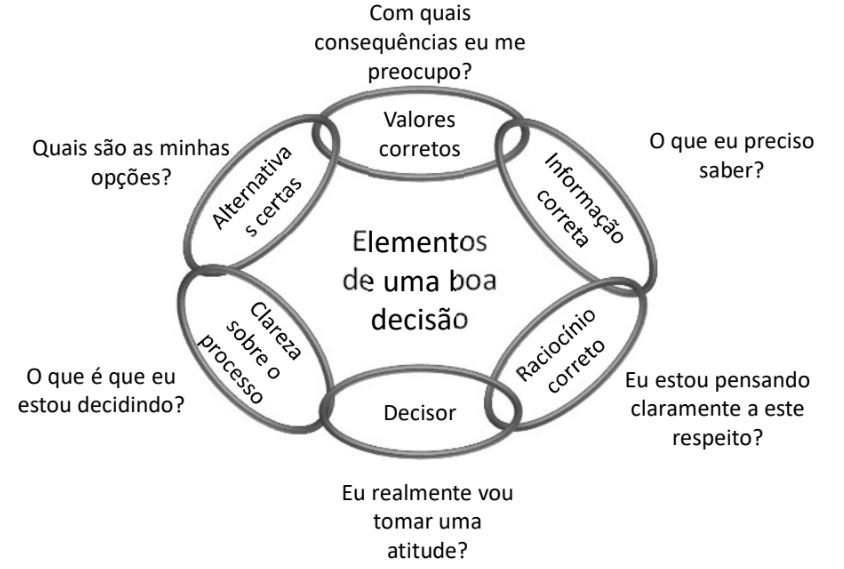

#  1 BASE DE SAD

Sistema de apoio à decisão (SAD) (também conhecido por Decision Support System (DSS))

### Definição de SAD:

Um sistema de informação consistindo de hardware/software e do elemento humano designado para assistir um tomador de decisão de qualquer nível, com ênfase em tarefas estruturadas e não-estruturadas (um sistema usado para explorar alternativas possíveis que auxiliam na tomada de decisão)

```
O SAD serve para decisões não estruturadas. QUE não é simplesmente programar um sistema, é preciso entender qual a utilidade, designação e estruturar a aplicação. O problema muitas vezes não está formulado ou dado o cliente muitas vezes não sabe o que quer.
 
Cabe a você compatibilizar os aspectos humanos, decisórios, modelos, base de dados… tudo que vai ser necessário para esse problema de decisão.
```

## (Introdução) Características da tomada de decisão

- Pensamento de grupo: Membros do grupo aceitam soluções sem refletir, o que pode levar a decisões ruins

- Avaliação de cenários what-if 

- Experimentação de um sistema real é muito custoso (deveria testar num modelo antes?!?)

- Mudanças no ambiente de tomada de decisão podem ocorrer constantemente: - Isso altera as premissas do modelo! (deve verificar o que é dinâmico e o que não é dinâmico)(por exemplo,(em um sistema tipo ifood) as entregas em dias de feriado podem aumentar, exigindo uma visão diferente do problema).

- Impondo pressão de tempo sobre o decisor.(influencia na qualidade da tomada de decisão)

- A análise de um problema custa tempo/dinheiro: - É difícil fazer o trade-off e decidir o escopo para tomar uma decisão (É difícil determinar quando parar e tomar uma decisão - dependendo do problema você não vai perder tempo com o problema)

- Informação insuficiente ou em abundância isso atrapalha. Informação demais atrapalha porque você não consegue enchergar o que é relevante.


### O SAD envolve quatro tipos básicos de modelagem analítica.

- Análise tipo what if "o que-se".

  O usuário introduz mudanças nas variáveis ou relações e verifica as mudanças resultantes nos valores das outras variáveis
 
  Ex: Se o orçamento com marketing aumentar em 2%, qual será o impacto total nas vendas?

- Análise de busca de metas (busca de objetivo).

  Alterando os valores das variáveis finais (metas) é observada a mudança das outras variávies

  Ex: Quanto se deve gastar com marketing para se gerar R$50.000,00 de vendas totais.

- Análise de sensibilidade.

  É um caso especial da análise what if, onde a mudança repetida de um única variável faz com que sejam observadas as mudanças nas outras variáveis. Permite desenvolver análises aplicando diferentes variáveis.

  Ex: Qual o preço máximo que se deve pagar pela matéria-prima e ainda obter lucro?

- Análise de Otimização.

  É uma extensão da análise busca de metas, onde ao invés de fixar uma meta, a meta é encontrar a solução ótima para uma ou mais variáveis alvo do problema.
  
  Geralmente a otimização é alcançadas através de programação matemática, sendo que às vezes, devido à complexidade do sistema, são adotados modelos heurísticos que usam métodos de inteligência artificial. Os métodos de inteligência arificial muitas vezes não encontram a solução ótima, mas encontram uma solução próxima da ótima

### Conhecimentos para construir um SAD Bem sucedido

A construção de um SAD bem-sucedido requer um conhecimento profundo destes conceitos:

- Support: métodos de apoio a decisão

- Decision Making: aspectos cognitivos que estão envolvidos no aspecto decisório

- System: O que o sistema pode contribuir

- Models and data: Como elaborar modelos e enriquecer através de dados.

### Etapas para um SAD

Processo de 4 etapas conforme proposto por Simon:

- Definição / Estruturação do problema de decisão (oportunidade de decisão)

- Construção de um **modelo** que descreve o problema do mundo real

- Identificação de possíveis soluções para o problema e avaliação de soluções

- Comparação, escolha e recomendação de uma solução potencial para o problema


### 


# 2 Tipos de Decisões


# 3 Fases do processo de decisão


# 4 Modelagem de problemas


# 5 Métodos de estruturação de problemas


# 6 Métodos de estruturação de problemas (VFT e AFT)

Projeto de Ciência de Dados

"um projeto que usa técnicas estatísticas e de aprendizado de máquina em grandes volumes de dados não estruturados e/ou estruturados gerados por sistemas, pessoas, sensores ou rastros digitais de informações de pessoas."

Este trabalho é feito em um ambiente computacional com o objetivo de identificar correlações e relações causais, classificar e prever eventos, identificar padrões e anomalias e inferir probabilidades, interesse e sentimento.

ciclo de vida da ciência de dados


**1. compreensão do negócio -> 2. compreensão de dados -> 3. preparação dos dados -> 4. modelagem -> 5. Avaliação -> 6. Implantação -> 7. Monitoramento**

## VALUE-FOCUSED THINKING - VFT

Os valores são o motivo de ficarmos pensando na decisão!

Mas o que são valores?

- Eles especificam o que é importante nas decisões que você toma;

- Indicam o que você espera alcançar ao tomar aquela decisão

- Deixam claro o significado do que é melhor para você naquele contexto de decisão

### O Processo Padrão de Tomada de Decisão (Tomada de decisão com foco na alternativa):

1. Ocorre um Problema -> 2. Identificam-se as alternativas (muitas vezes apenas aceita-se) -> 3. Avaliam-se as alternativas -> 4. Escolhe

Problema: Este processo é reativa e inversa:

– É uma reação a um problema que ocorreu.

– É inversa porque se concentra em alternativas antes de ser claro sobre o que a decisão deve alcançar. 

(Alternativas são meios para alcançar seus **valores**, então **comece com valores.**)

### VALUE-FOCUSED THINKING - VFT

Uma abordagem de decisão mais útil e capacitadora é baseada em seus valores. 

• Para um problema de decisão ou uma oportunidade de decisão: 

– comece com seus valores: seu primeiro pensamento consciente deve ser sobre seus valores. 
– Seus valores, então, guiam tudo o que você faz em relação a essa decisão.

– É uma tomada de decisão proativa e com visão de futuro.

(26-45) - verificar esse slide

Tomar decisões de qualidade, requer prática.

• Se você não sabe o que quer alcançar tomando uma decisão, é impossível pensar na melhor forma de alcançá-lo. 
• A regra principal de qualquer processo de decisão coerente é “entender com o que você se importa em relação à decisão que enfrenta”. 
• Valores que deem significado para as consequências de suas decisões.

• É importante dedicar um sério esforço à especificação de objetivos

• Processo para identificar valores:
1. Crie uma lista de desejos. Inclua todos os valores que você espera alcançar na situação de decisão.
2. Estimule valores adicionais usando técnicas de sondagem da mente.
3. Peça que outras pessoas sugiram valores
4. Use valores identificados para identificar valores adicionais

VALOR X OBJETIVO

• É útil declarar valores no formato de um objetivo. 
• Um valor é qualquer coisa com que um decisor se preocupa em uma decisão

• Um objetivo é um valor declarado em um formato verbo-objeto, por exemplo:

– 'dinheiro' se torna 'maximizar meu salário' ou 'maximizar lucros' 

– ‘muito gelo derretido’ pode se tornar ‘preservar o habitat do urso polar’

• Objetivo Fundamental: um objetivo que define uma razão básica para se preocupar com uma decisão. 
• Objetivo Meio: um objetivo cuja importância decorre de sua influência na consecução de outros objetivos.


• Os objetivos fundamentais podem ser estruturados em uma
hierarquia
• O objetivo mais geral está no topo
• Objetivos de nível inferior explicam o significado dos objetivos de
nível superior 
• A realização dos objetivos de nível mais baixo pode ser medida
usando “métricas” para descrever e avaliar as várias alternativas


• Somente objetivos fundamentais devem ser usados para avaliar e
comparar alternativas. 
– A realização dos objetivos de nível mais baixo pode ser medida
usando “atributos” para descrever e avaliar as várias alternativas. 
• Significa que os objetivos podem ser usados para criar alternativas
• Se um objetivo é um meio ou um objetivo fundamental depende do contexto de decisão


# 7 Teoria da Decisão 

Metodologia para considerar que as decisões foram tomadas da melhor forma possível (medir a intensidade das alternativas para extrair a melhor decisão)

Precisamos da garantia da racionalidade na tomada de decisão

Dominância estocástica - buscar soluções melhores

A teoria da decisão não surge como uma teoria que tenta descrever ou explicar o comportamento das pessoas (ou instituições) ou como elas tomam suas decisões

– Ela busca organizar de forma lógica parâmetros que possam ajudar na tomada de decisões, face as preferências do agente decisor e ao que se deseja obter.

## Decisão

“Curso de ação escolhido pela pessoa, como o meio mais efetivo à sua disposição, para alcançar os objetivos pretendidos”

E, segundo esta teoria, uma boa decisão deverá ser uma função lógica **daquilo que se quer**, **daquilo que se sabe** e **daquilo que se pode fazer**.” (Souza, 2007)

#### Decisão sob Incerteza 

O decisor Não consegue estimar a probabilidade de orrência dos cenários

#### Decisão sob Risco

Quando o decisor conhece a probabilidade de ocorrência dos cenários, por conseguinte, pode avaliar o risco associado a decisão adotada

#### Perspectiva de Análise da Decisão:

– Descritiva: descreve a realidade das ações como elas são. A física é descritiva porque os modelos da física têm a intensão de descrever a realidade e podem ser comprovados experimentalmente (lei da gravidade)

– Normativa: identifica como as ações deveriam ser

– Prescritiva: quando está prescrevendo uma recomendação específica

### Decisão X Consequência


(As pessoas tem uma dificuldade em entender o que é uma boa decisão. Uma boa decisão é fruto do uso de boas metodologias e de um bom processo decisório)(você pode ter resultados ruins para uma determinada decisão isso não significa que a decisão não teve qualidade - você deu azar. mas que você fez tudo que esteve em seu alcance para tomar a melhor decisão possível)

### Elementos de uma boa decisao



- utilidade: (O nível de desajabilidade que aquela consequencia tem)

- Escala útil: (Escala usada em muitos modelos economicos para mensurar e antecipar muitos comportamentos)


# 8 Arvore de Decisão


# 9 Teoria dos Jogos
